# Smart Cloud

Smart Cloud 是一个基于 Java 17、Spring Boot 3.5.x、Spring Cloud 2025.x 与 Spring Cloud Alibaba 的企业级快速开发平台。工程采用 Maven 多模块组织，支持以 `develop-server` 组装为模块化单体，也保留 `develop-gateway`、Nacos、RPC、MQ、XXL-Job、监控链路等微服务支撑能力。

当前代码处于 DDD / 六边形架构渐进式重构阶段：部分模块已经迁移到 `domain`、`application`、`infrastructure` 分层，部分模块仍保留传统 `controller`、`service`、`dal` 结构。新开发与重构应优先遵循仓库中的 DDD 标准，逐步将核心业务逻辑从旧三层迁移到领域模型。

## 目录

- [项目定位](#项目定位)
- [架构设计思路](#架构设计思路)
- [整体架构图](#整体架构图)
- [部署与路由图](#部署与路由图)
- [工程结构](#工程结构)
- [模块内架构图](#模块内架构图)
- [模块与组件调用关系](#模块与组件调用关系)
- [核心代码流程图](#核心代码流程图)
- [典型业务链路图](#典型业务链路图)
- [技术栈](#技术栈)
- [快速开始](#快速开始)
- [配置说明](#配置说明)
- [API 文档](#api-文档)
- [DDD 架构约定](#ddd-架构约定)
- [测试与验证](#测试与验证)
- [相关文档](#相关文档)
- [License](#license)

## 项目定位

Smart Cloud 的目标是提供一套可扩展、可裁剪、可演进的企业级后端平台。它不是单一业务系统，而是一个由基础框架、运行容器、网关、业务模块和前端工程共同组成的开发平台。

核心能力：

- **模块化后端**：业务域拆分为独立 Maven 模块，通常采用 `api + server` 双模块结构。
- **按需装配**：`develop-server` 通过 Maven 依赖决定启用哪些业务模块，默认只启用系统与基础设施模块。
- **微服务演进**：保留网关、注册配置、RPC、MQ、监控等基础能力，支持从模块化单体逐步演进到微服务。
- **统一基础框架**：Web、安全、MyBatis、Redis、MQ、RPC、租户、数据权限、监控、Excel、测试等能力沉淀到 `develop-framework`。
- **多数据库支持**：SQL 初始化脚本覆盖 MySQL、Oracle、PostgreSQL、SQL Server、DM、Kingbase、OpenGauss 等数据库。
- **DDD 渐进迁移**：新代码以领域模型为核心，旧三层代码作为迁移来源逐步收敛。

## 架构设计思路

### 1. 模块化单体优先，保留微服务能力

当前默认运行方式是 `develop-server` 聚合业务模块，以一个 Spring Boot 应用启动。这样可以降低本地开发、调试、编译和部署复杂度。与此同时，工程保留 `develop-gateway`、Nacos、RPC、MQ、XXL-Job、监控链路等分布式组件，为后续按业务域拆分微服务保留演进路径。

### 2. API 契约与业务实现隔离

大部分业务模块采用 `api + server` 拆分：

- `api` 放跨模块 DTO、枚举、RPC API、CommonApi 契约。
- `server` 放 Controller、Service/ApplicationService、Domain、Infrastructure、DAL、MQ、Job 等实现。

调用方依赖目标模块的 `api`，避免直接依赖对方 `server`。`develop-server` 只负责装配各业务 `server`，不承载业务逻辑。

### 3. 基础能力下沉到 Framework Starter

通用技术能力统一沉淀在 `develop-framework`：Web 与统一响应、异常处理、API 日志、接口文档；Security、租户、数据权限、操作日志；MyBatis Plus、多数据源、Redis、MQ、RPC、XXL-Job；Excel、WebSocket、监控、服务保护、测试基类等。

### 4. DDD 渐进重构，不破坏现有业务行为

项目正在从传统三层向 DDD / 六边形架构迁移。重构原则是按模块、按聚合逐步迁移，保持原有业务逻辑兼容；`domain` 保持纯净，`application` 负责用例编排与事务边界，`infrastructure` 负责技术适配。

### 5. 配置与版本集中治理

依赖版本集中在 `develop-dependencies/pom.xml` 与根 `pom.xml`，运行配置按 `application.yaml`、`application-local.yaml`、`application-dev.yaml` 分层维护。默认本地配置关闭 Nacos，便于单机启动。

## 整体架构图

### Smart Cloud 整体运行时架构

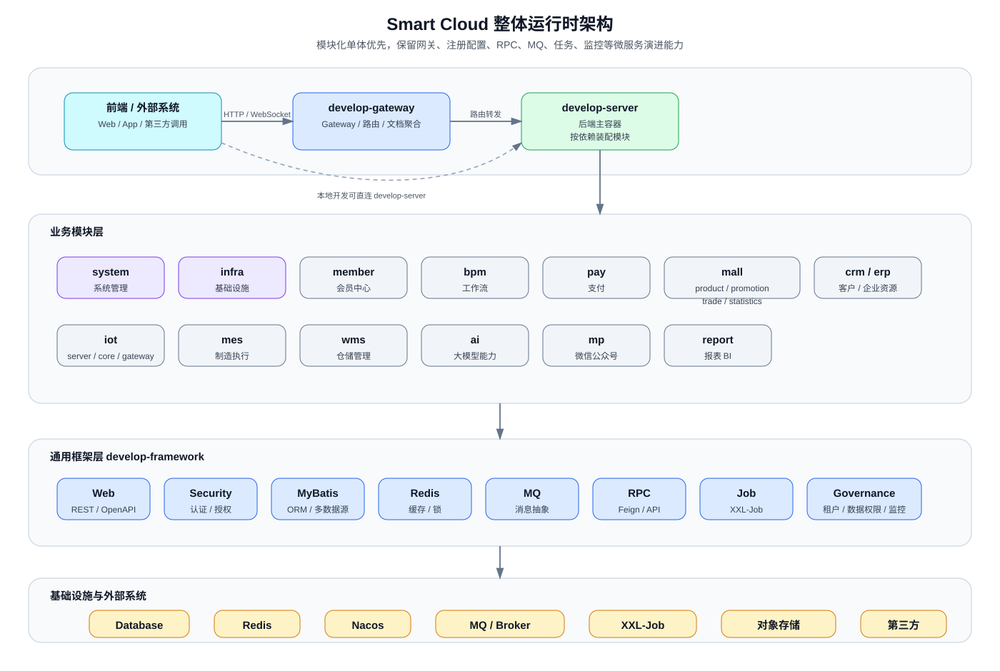

### 标准业务模块内部架构

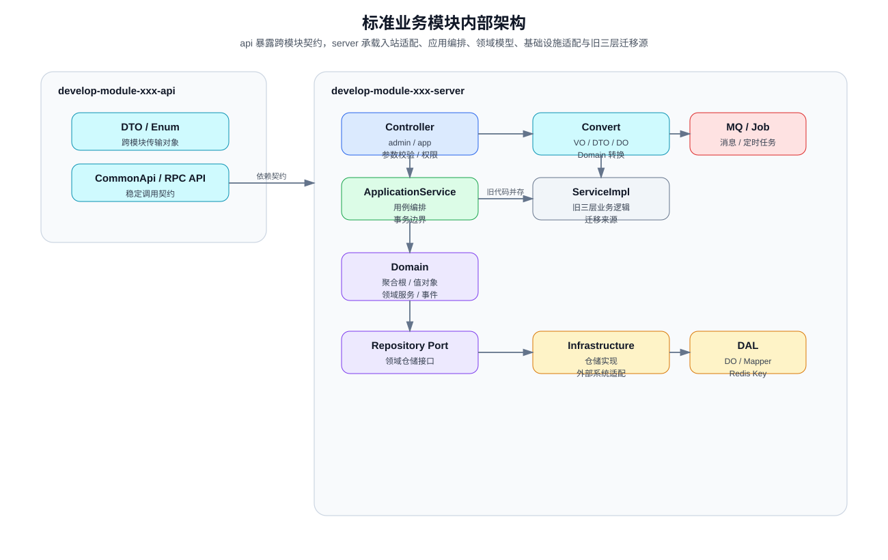

## 部署与路由图

### 本地开发部署拓扑

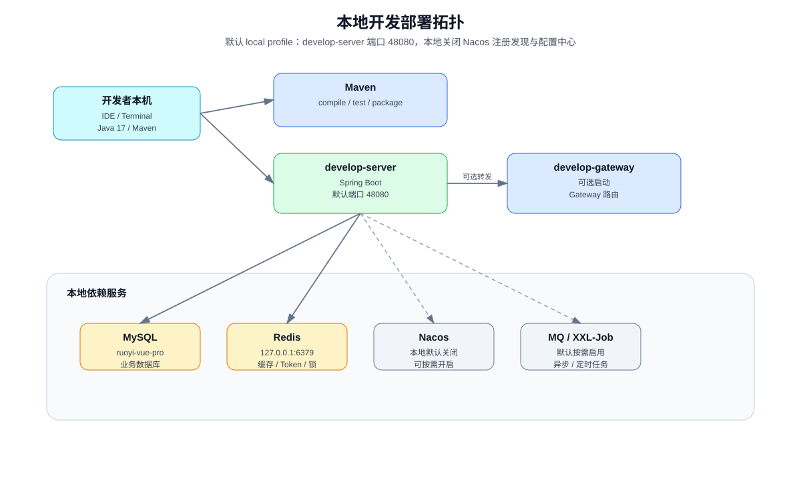

### 网关路由与文档聚合

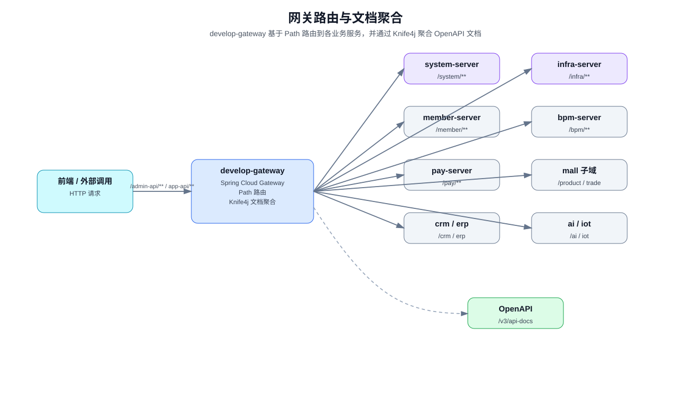

## 工程结构

```text
develop-dependencies/          # BOM，统一管理第三方依赖与内部 Starter 版本
develop-framework/             # 通用框架与 Spring Boot Starter
develop-gateway/               # Spring Cloud Gateway 网关应用
develop-server/                # 后端主启动容器，按依赖装配业务模块
develop-module-{name}/         # 业务模块，通常包含 api 与 server 子模块
develop-ui/                    # 前端工程目录
sql/                           # 多数据库初始化脚本
script/                        # 辅助脚本
docs/                          # 架构与工程文档
```

主要业务模块：

| 模块 | 说明 | 默认启用 |
|---|---|---|
| `develop-module-system` | 系统管理、用户、角色、菜单、租户、认证授权、字典、日志等 | 是 |
| `develop-module-infra` | 文件、代码生成、配置、API 日志、定时任务、WebSocket 等 | 是 |
| `develop-module-member` | 会员用户、等级、积分、签到、地址、标签、分组等 | 否 |
| `develop-module-bpm` | Flowable 工作流、模型、流程、任务、表单、OA 请假等 | 否 |
| `develop-module-pay` | 支付应用、渠道、订单、退款、回调、钱包等 | 否 |
| `develop-module-report` | JimuReport、JimuBI、报表设计与数据可视化 | 否 |
| `develop-module-mp` | 微信公众号账号、菜单、粉丝、素材、自动回复等 | 否 |
| `develop-module-mall` | 商品、营销、交易、统计等商城子域 | 否 |
| `develop-module-crm` | 客户、联系人、商机、合同、回款、线索等 | 否 |
| `develop-module-erp` | 采购、销售、库存、财务、产品、供应商、客户等 | 否 |
| `develop-module-iot` | 产品、设备、物模型、协议网关、设备消息等 | 否 |
| `develop-module-mes` | 生产计划、工单、工艺、工序、质量、物料等 | 否 |
| `develop-module-wms` | 仓库、库区、库位、库存、入库、出库、盘点等 | 否 |
| `develop-module-ai` | AI 模型、聊天、知识库、向量、图片、工作流、工具等 | 否 |

## 模块内架构图

### API 本地 / 远程适配模式

`api` 模块提供稳定契约；单体模式下优先通过本地 Spring Bean 调用，微服务模式下可切换为 Feign/RPC 远程调用。这样既保留本地开发效率，也为服务拆分保留接口边界。

### 模块启用与装配流程

启用可选模块时，需要同步处理根 `pom.xml` 的 Maven module、`develop-server/pom.xml` 的 server 依赖，以及对应配置文件中的数据库、中间件和第三方参数。

## 模块与组件调用关系

### 业务模块与基础组件关系

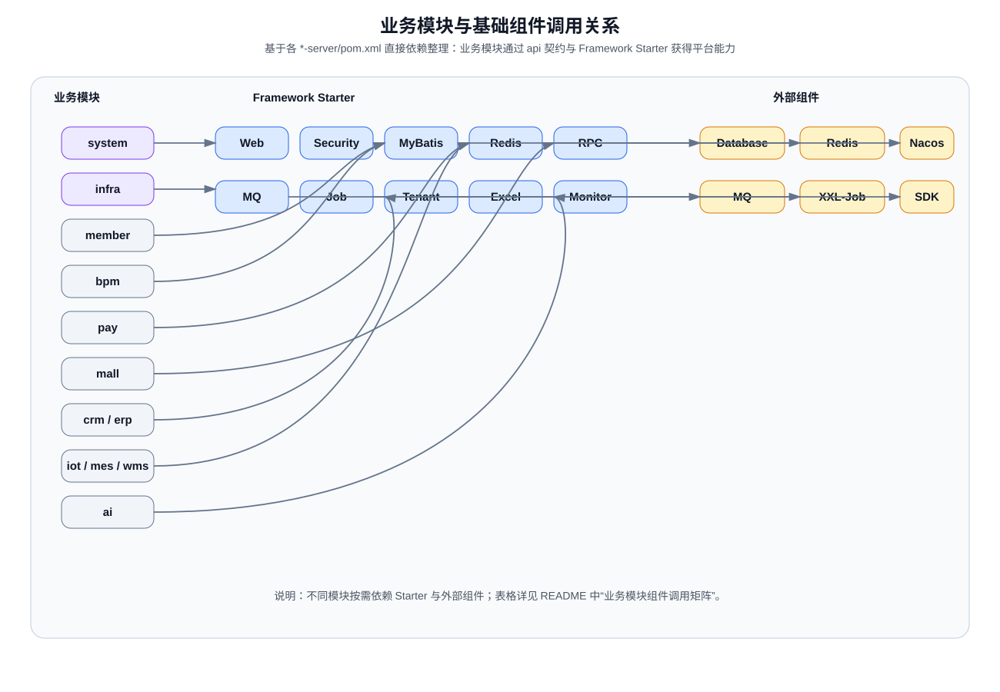

### 顶层运行组件职责

| 组件 | 职责 | 关键依赖 |
|---|---|---|
| `develop-server` | 后端主容器，按 Maven 依赖装配业务模块 | system-server、infra-server、可选业务 server、Nacos、RPC Starter、Protection Starter |
| `develop-gateway` | API 网关、路由、文档聚合、统一入口 | Spring Cloud Gateway、Knife4j Gateway、LoadBalancer、Nacos、system-api、Monitor Starter |
| `develop-framework` | 基础能力 Starter 集合 | Web、Security、MyBatis、Redis、MQ、RPC、Job、Monitor、Tenant、DataPermission 等 |
| `develop-dependencies` | 依赖版本治理 | Spring Boot、Spring Cloud、Spring Cloud Alibaba、MyBatis、Redis、Flowable、工具库等版本 |

### Framework Starter 能力矩阵

| Starter | 主要能力 | 典型调用方 |
|---|---|---|
| `develop-spring-boot-starter-web` | REST、统一异常、Swagger/Knife4j、Jackson、XSS、API 加密 | 所有 Web 业务模块 |
| `develop-spring-boot-starter-security` | 登录用户上下文、认证授权、权限校验、操作日志 | system、infra、member、mall、crm、erp、mes、wms、ai 等 |
| `develop-spring-boot-starter-mybatis` | MyBatis Plus、多数据源、分页、数据翻译 | 所有持久化模块 |
| `develop-spring-boot-starter-redis` | Redis、Redisson、缓存配置 | system、infra、member、trade、pay、iot、mes、wms、ai 等 |
| `develop-spring-boot-starter-mq` | Redis/RabbitMQ/RocketMQ 消息抽象 | system、infra、member、promotion、iot 等 |
| `develop-spring-boot-starter-rpc` | OpenFeign、负载均衡、跨模块/跨服务调用 | 需要跨模块 API 的模块 |
| `develop-spring-boot-starter-job` | XXL-Job 执行器与任务配置 | system、infra、pay、promotion、trade、crm、ai、iot 等 |
| `develop-spring-boot-starter-monitor` | 链路追踪、指标、监控接入 | 网关与大部分业务模块 |
| `develop-spring-boot-starter-biz-tenant` | 租户上下文、租户过滤、租户透传 | 多租户业务模块 |
| `develop-spring-boot-starter-biz-data-permission` | 数据权限规则、部门数据权限、SQL 过滤 | system、bpm 等需要数据范围控制的模块 |
| `develop-spring-boot-starter-excel` | Excel 导入导出、字典格式化 | 后台管理模块 |
| `develop-spring-boot-starter-websocket` | WebSocket 会话、消息发送、多节点广播 | infra |
| `develop-spring-boot-starter-protection` | API 签名、幂等、锁、限流等服务保护能力 | develop-server |
| `develop-spring-boot-starter-test` | 测试基类、断言、随机对象、测试工具 | 模块测试 |

### 业务模块组件调用矩阵

以下矩阵基于各 `*-server/pom.xml` 的依赖关系整理，展示模块直接依赖的主要 API、Starter 与外部组件。

| 模块 | 依赖的业务 API | 主要 Starter / 基础组件 | 专用外部组件 |
|---|---|---|---|
| `system-server` | `system-api`、`infra-api` | env、tenant、data-permission、biz-ip、security、mybatis、redis、rpc、job、mq、excel、monitor | Mail、JustAuth、WxJava MP/MiniApp、Captcha |
| `infra-server` | `infra-api` | env、tenant、security、websocket、mybatis、redis、rpc、job、mq、excel、monitor | 文件存储、代码生成、WebSocket |
| `member-server` | `member-api`、`system-api`、`infra-api` | env、tenant、security、validation、mybatis、redis、rpc、mq、excel、biz-ip、monitor | 会员积分、签到、标签等业务能力 |
| `bpm-server` | `bpm-api`、`system-api` | env、data-permission、tenant、security、mybatis、redis、rpc、excel、monitor | Flowable Process、Flowable Actuator |
| `pay-server` | `pay-api`、`system-api` | env、tenant、security、mybatis、redis、rpc、job、excel、monitor | 支付渠道 SDK、支付/退款同步任务 |
| `report-server` | `report-api`、`system-api`、`infra-api` | env、tenant、security、mybatis、redis、rpc、monitor | JimuReport、JimuBI |
| `mp-server` | `mp-api`、`system-api`、`infra-api` | env、tenant、security、validation、mybatis、redis、rpc、excel、monitor | WxJava MP |
| `product-server` | `product-api`、`member-api` | env、tenant、web、security、mybatis、rpc、excel、monitor | 商品 SPU/SKU、分类、库存等 |
| `promotion-server` | `promotion-api`、`product-api`、`trade-api`、`member-api`、`system-api`、`infra-api` | env、tenant、web、security、mybatis、rpc、job、mq、excel、monitor | 优惠券、秒杀、拼团、满减等营销任务 |
| `trade-server` | `trade-api`、`product-api`、`pay-api`、`promotion-api`、`member-api`、`system-api` | env、tenant、biz-ip、web、security、mybatis、redis、rpc、job、excel、monitor | 购物车、订单、售后、配送、结算 |
| `statistics-server` | `statistics-api`、`promotion-api`、`product-api`、`trade-api`、`member-api`、`pay-api` | env、tenant、biz-ip、web、security、mybatis、rpc、job、excel、monitor | 商城统计聚合 |
| `crm-server` | `crm-api`、`system-api`、`infra-api`、`bpm-api` | env、biz-ip、tenant、security、mybatis、rpc、job、excel、monitor | CRM 跟进、合同、回款、审批联动 |
| `erp-server` | `erp-api`、`system-api` | env、tenant、security、mybatis、redis、rpc、excel、monitor | 采购、销售、库存、财务单据 |
| `iot-server` | `iot-api`、`iot-core`、`system-api` | env、tenant、web、security、mybatis、redis、rpc、job、mq、excel | RocketMQ、Kafka、RabbitMQ、设备协议能力 |
| `mes-server` | `mes-api`、`system-api` | env、tenant、security、mybatis、redis、rpc、excel、monitor | 生产计划、工单、质量、物料 |
| `wms-server` | `wms-api`、`system-api` | env、tenant、security、mybatis、redis、rpc、excel、monitor | 库存、入库、出库、盘点聚合 |
| `ai-server` | `ai-api`、`system-api`、`infra-api` | env、tenant、security、mybatis、rpc、job、excel、monitor、redis | Spring AI、OpenAI、Azure OpenAI、Anthropic、DeepSeek、Ollama、DashScope、Qianfan、Moonshot、Qdrant、Redis Vector、Milvus、Tika |

## 核心代码流程图

### 后台管理接口请求时序

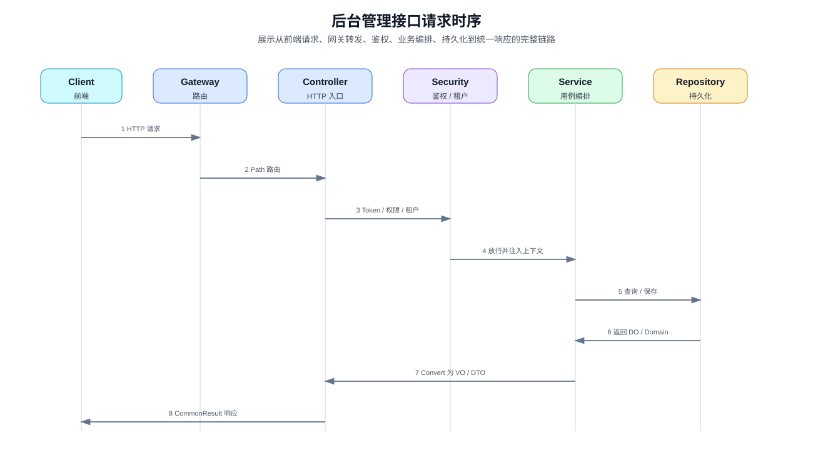

### 登录认证与权限校验时序

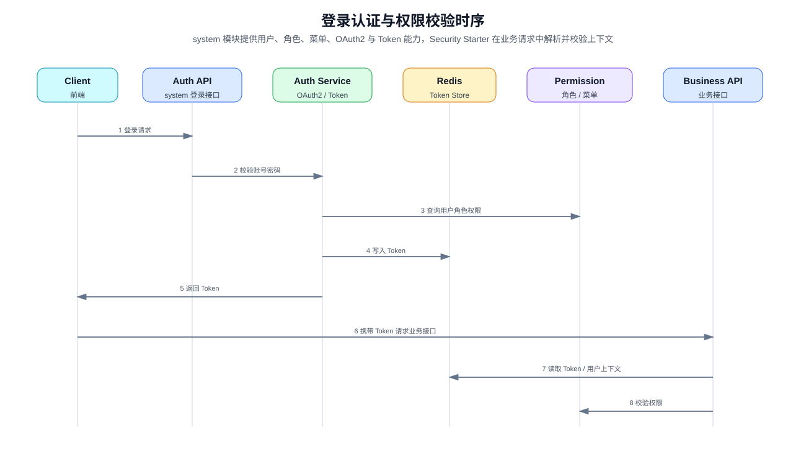

### DDD 聚合写入流程

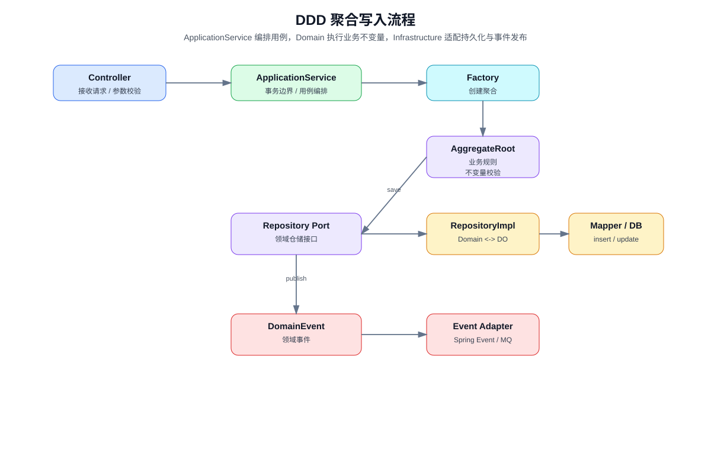

### 消息与定时任务处理链路

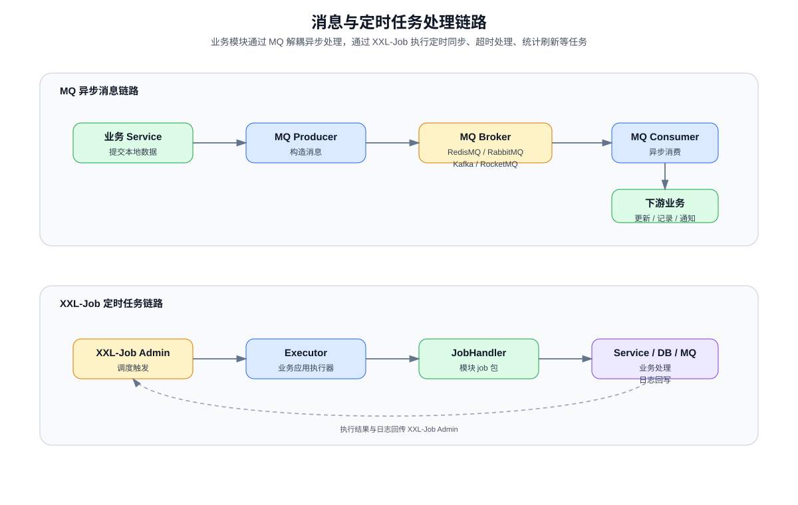

## 典型业务链路图

### 商城交易与支付协作链路

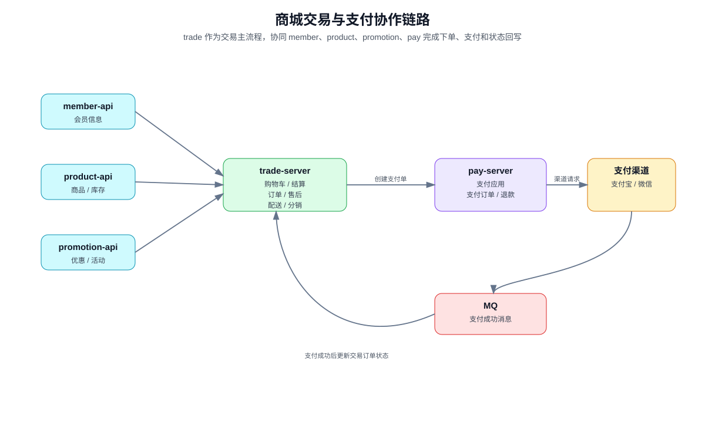

### AI 知识库处理流程

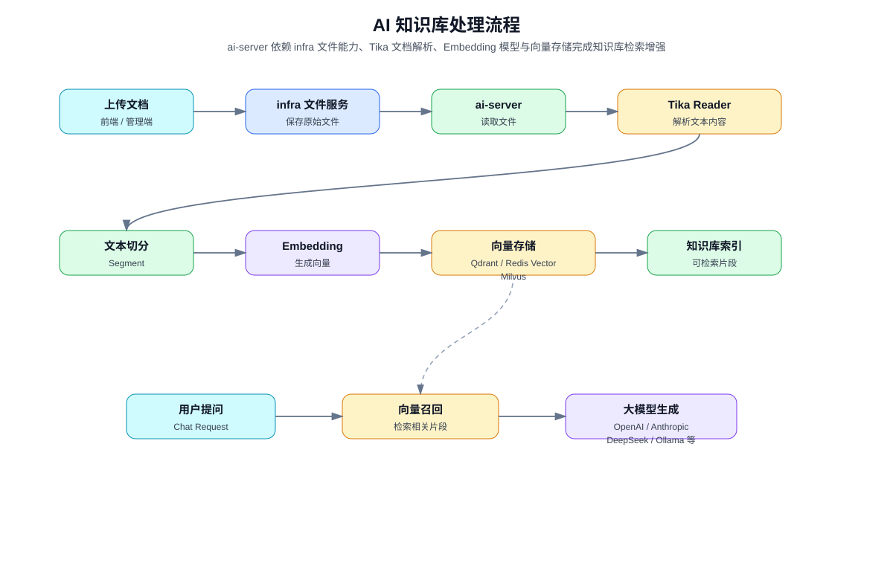

## 技术栈

版本以 `pom.xml` 与 `develop-dependencies/pom.xml` 为准。

| 分类 | 技术 |
|---|---|
| JDK | Java 17 |
| 构建 | Maven |
| 应用框架 | Spring Boot 3.5.x |
| 微服务 | Spring Cloud 2025.0.1、Spring Cloud Alibaba 2025.0.0.0 |
| 网关 | Spring Cloud Gateway |
| 注册与配置 | Nacos Discovery、Nacos Config |
| ORM | MyBatis、MyBatis Plus、MyBatis Plus Join |
| 数据源 | dynamic-datasource、Druid |
| 缓存与锁 | Redis、Redisson、Lock4j |
| 消息队列 | Redis MQ、RabbitMQ、Kafka、RocketMQ 抽象支持 |
| 工作流 | Flowable |
| 定时任务 | XXL-Job |
| 接口文档 | Springdoc OpenAPI、Knife4j |
| 对象转换 | MapStruct |
| 工具库 | Lombok、Hutool、Guava、Apache Commons、FastJSON、Jsoup、Tika |
| 测试 | JUnit 5、Spring Boot Test、Mockito、Jedis Mock、Podam |
| 监控链路 | Spring Boot Admin、SkyWalking、OpenTracing |
| 报表 | JimuReport、JimuBI |
| AI | Spring AI、OpenAI、Azure OpenAI、Anthropic、DeepSeek、Ollama、DashScope、Qdrant、Milvus、Redis Vector |
| IoT | MQTT、Vert.x、CoAP、Modbus |

## 快速开始

### 环境要求

- JDK 17
- Maven 3.8+
- MySQL、Redis 等本地依赖服务按当前 profile 配置准备
- 本仓库未包含 Maven Wrapper，请使用本机 `mvn`

### 初始化数据库

数据库脚本位于 `sql/` 目录。请根据目标数据库选择对应脚本，并与 `develop-server/src/main/resources/application-local.yaml` 中的数据源配置保持一致。

默认本地配置示例：

- 后端服务端口：`48080`
- 主数据源：`jdbc:mysql://127.0.0.1:3306/ruoyi-vue-pro`
- Redis：`127.0.0.1:6379`
- 本地 profile：`local`
- 本地默认关闭 Nacos 注册发现与配置中心

### 编译

```bash
mvn compile
```

只编译主服务及其依赖：

```bash
mvn compile -pl develop-server -am
```

### 打包

```bash
mvn clean package -Dmaven.test.skip=true
```

只打包主服务及其依赖：

```bash
mvn clean package -pl develop-server -am -Dmaven.test.skip=true
```

只打包网关及其依赖：

```bash
mvn clean package -pl develop-gateway -am -Dmaven.test.skip=true
```

### 运行

运行后端主服务：

```bash
mvn spring-boot:run -pl develop-server -am
```

运行网关：

```bash
mvn spring-boot:run -pl develop-gateway -am
```

### 测试

运行指定模块测试：

```bash
mvn test -pl develop-module-system/develop-module-system-server
```

运行指定测试类或测试方法：

```bash
mvn test -pl develop-module-system/develop-module-system-server -Dtest=AdminUserServiceImplTest
mvn test -pl develop-module-system/develop-module-system-server -Dtest=AdminUserServiceImplTest#testCreateUser_success
```

## 配置说明

主服务配置文件：

```text
develop-server/src/main/resources/application.yaml
develop-server/src/main/resources/application-local.yaml
develop-server/src/main/resources/application-dev.yaml
```

网关配置文件：

```text
develop-gateway/src/main/resources/application.yaml
develop-gateway/src/main/resources/application-local.yaml
develop-gateway/src/main/resources/application-dev.yaml
```

`application.yaml` 负责通用配置和 profile 引入，`application-local.yaml` 用于本地开发，`application-dev.yaml` 用于开发环境。生产环境部署前应按实际中间件、数据库、对象存储、第三方平台密钥和安全策略调整配置。

## API 文档

主服务默认启用 Springdoc 与 Knife4j：

- OpenAPI JSON：`/v3/api-docs`
- Swagger UI：`/swagger-ui`

实际访问地址取决于运行端口和网关部署方式。本地直接运行 `develop-server` 时，默认端口来自 `application-local.yaml`。

## DDD 架构约定

新结构按以下层次组织：

```text
domain/{aggregate}/            # 聚合根、值对象、领域服务、领域事件、仓储接口
application/{aggregate}/       # 应用服务，用例编排，通过领域仓储接口访问数据
infrastructure/{aggregate}/    # 仓储实现、MyBatis 适配、外部系统适配
convert/                       # DO、DTO、领域对象之间的转换
```

约束：

- `domain` 保持纯 Java，不依赖 Spring、MyBatis 或基础设施实现。
- `application` 负责用例编排，不承载底层持久化细节。
- `infrastructure` 实现领域仓储接口并适配 DAL、外部服务或中间件。
- `service` 与 `dal` 是旧结构和迁移来源，不应作为新增核心业务逻辑的最终归宿。
- 修改聚合或模块结构前，应先阅读 `.claude/ddd-skills/` 下对应聚合技能和标准文档。

## 测试与验证

常用验证命令：

```bash
# 全量编译
mvn compile

# 编译单个模块及其依赖
mvn compile -pl develop-module-system/develop-module-system-server -am

# 运行模块测试
mvn test -pl develop-module-system/develop-module-system-server

# 打包主服务
mvn clean package -pl develop-server -am -Dmaven.test.skip=true
```

建议策略：

- Framework Starter 优先做单元测试和切片测试。
- 业务模块优先测试 ApplicationService、Domain、Repository 和关键 Service。
- DDD 聚合改动必须验证领域不变量、仓储转换和应用服务编排。
- 跨模块能力通过 `api` DTO、CommonApi、本地/远程适配做契约验证。

## 相关文档

- [`CLAUDE.md`](CLAUDE.md)：项目协作、构建运行、DDD 重构与模块标准说明。
- [`docs/backend-architecture-design.md`](docs/backend-architecture-design.md)：后端架构设计文档。
- [`docs/backend-class-method-index.md`](docs/backend-class-method-index.md)：后端类与方法索引。
- [`sql/tools/README.md`](sql/tools/README.md)：SQL 工具说明。
- [`sql/db2/README.md`](sql/db2/README.md)：DB2 相关说明。

## 前端工程

`develop-ui/` 下包含多个前端工程目录。不同前端子项目的依赖、构建命令和运行方式以各自目录内的 README 或项目配置为准；根 README 不假设统一的前端包管理器。

## License

本项目使用 MIT License，详见 [`LICENSE`](LICENSE)。
