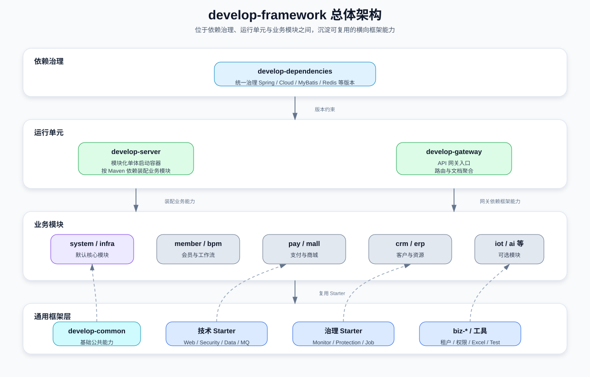
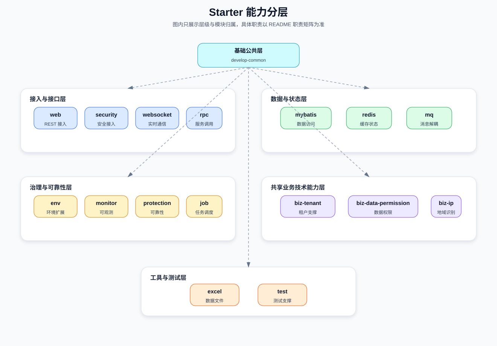
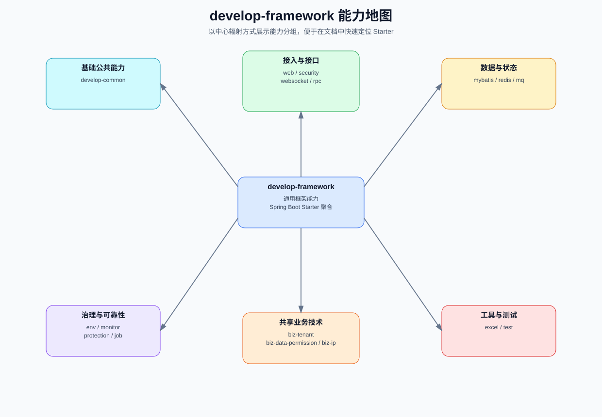
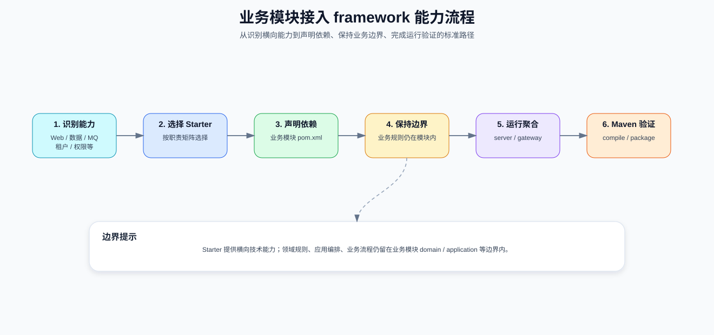
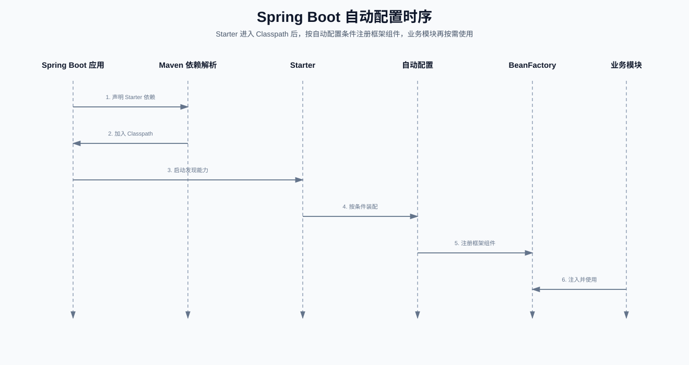
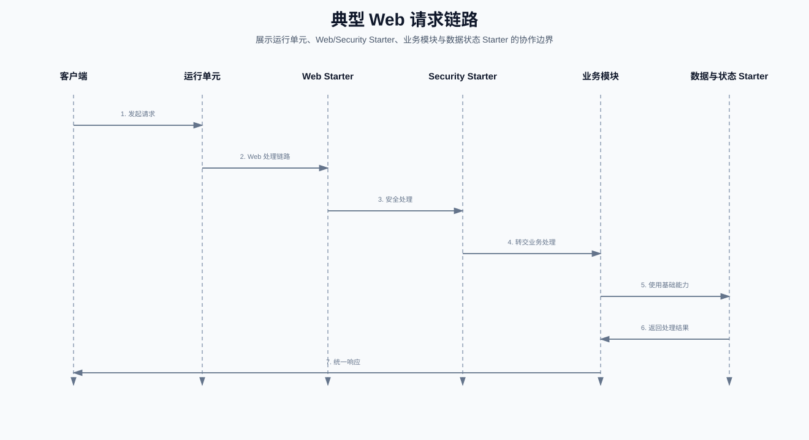

# develop-framework

## 模块定位

`develop-framework` 是 Smart Cloud 后端工程中的通用框架与 Spring Boot Starter 聚合模块，Maven packaging 为 `pom`。它通过一组可复用的子模块，为运行单元与业务模块提供横向基础能力，包括 Web、安全、MyBatis、Redis、MQ、RPC、任务调度、监控、租户、数据权限、Excel、WebSocket、测试、环境扩展与 IP 能力。

该模块的职责边界是“输出通用框架能力”，而不是承载具体业务用例。业务规则、领域模型、应用用例与业务编排应保留在各业务模块内；`develop-framework` 不应反向依赖任何具体业务模块。

## 阅读导航

| 阅读目标 | 推荐章节 |
|---|---|
| 了解 `develop-framework` 在整体工程中的位置 | [模块定位](#模块定位)、[总体架构图](#总体架构图) |
| 快速判断某个 Starter 的职责 | [Starter 能力分层图](#starter-能力分层图)、[子模块职责矩阵](#子模块职责矩阵) |
| 为业务模块接入框架能力 | [业务模块接入流程](#业务模块接入流程)、[依赖与边界规则](#依赖与边界规则) |
| 理解自动配置与请求链路 | [Spring Boot 自动配置时序](#spring-boot-自动配置时序)、[典型 Web 请求链路](#典型-web-请求链路) |
| 修改或验证框架模块 | [构建与验证](#构建与验证)、[维护建议](#维护建议) |

## 设计目标

- **横向复用**：将 Web、安全、数据访问、缓存、消息、RPC、监控、保护、测试等能力沉淀为可复用 Starter，降低业务模块重复建设成本。
- **边界清晰**：框架模块只提供技术能力和共享业务技术能力，不承载具体业务用例，不反向依赖业务模块。
- **依赖统一**：依赖版本由 `develop-dependencies` BOM 统一治理，框架模块避免自行分散维护版本口径。
- **接入简单**：业务模块通过 Maven 依赖选择需要的 Starter，运行单元由 `develop-server`、`develop-gateway` 等应用聚合启动。
- **可维护可验证**：Starter 修改应关注自动配置条件、默认 Bean、拦截器、切面顺序和调用方兼容性，并通过 Maven 编译或打包验证。

## 总体架构图

图 1：`develop-framework` 位于依赖治理、运行单元与业务模块之间，向上提供通用技术支撑。



## Starter 能力分层图

以下能力为 Starter 提供的可选技术支撑，是否生效取决于依赖引入、配置与自动配置条件。

图 2：Starter 按接入、数据、治理、共享业务技术、工具测试等能力分层组织；节点仅展示层级与模块归属，详细职责见下方矩阵。



## 框架能力思维导图

图 3：能力导图只保留分组与模块名，用于快速定位；具体能力清单以子模块职责矩阵为准。



## 子模块职责矩阵

| 子模块 | 类型 | 核心职责 | 典型使用方 |
|---|---|---|---|
| `develop-common` | 基础公共模块 | 提供基础 POJO、枚举、工具类。 | 框架 Starter、业务模块、运行单元 |
| `develop-spring-boot-starter-env` | 框架 Starter | 提供开发与功能环境扩展，以及 Nacos 发现、配置相关支持。 | 需要环境扩展或 Nacos 发现、配置相关支持的运行单元与模块 |
| `develop-spring-boot-starter-mybatis` | 框架 Starter | 提供数据库连接池、动态数据源、事务、MyBatis 扩展能力。 | 需要数据库访问能力的业务模块 |
| `develop-spring-boot-starter-redis` | 框架 Starter | 基于 Spring Cache 与 Redisson 提供 Redis 扩展能力。 | 需要缓存、Redis 或 Redisson 能力的业务模块 |
| `develop-spring-boot-starter-web` | 框架 Starter | 提供 REST/Web 支持、全局异常处理、API 日志、脱敏、错误码、OpenAPI/Knife4j 能力。 | 暴露 REST 接口或需要 Web 基础能力的运行单元与业务模块 |
| `develop-spring-boot-starter-security` | 框架 Starter | 提供认证、授权与操作日志支持。 | 需要安全控制或操作日志能力的运行单元与业务模块 |
| `develop-spring-boot-starter-websocket` | 框架 Starter | 提供 WebSocket 框架与多节点广播支持。 | 需要 WebSocket 通信能力的业务模块或运行单元 |
| `develop-spring-boot-starter-monitor` | 框架 Starter | 提供链路追踪、日志服务、指标、Spring Boot Admin Client 支持。 | 需要监控、追踪、日志或管理端接入的运行单元 |
| `develop-spring-boot-starter-protection` | 框架 Starter | 提供分布式锁、幂等、限流、熔断能力。 | 需要可靠性保护与流量保护的业务模块 |
| `develop-spring-boot-starter-job` | 框架 Starter | 提供 XXL-Job 扩展能力。 | 需要分布式任务调度的业务模块或运行单元 |
| `develop-spring-boot-starter-mq` | 框架 Starter | 提供 Redis、RocketMQ、RabbitMQ、Kafka 的 MQ 抽象能力。 | 需要消息生产、消费或异步解耦的业务模块 |
| `develop-spring-boot-starter-rpc` | 框架 Starter | 提供 OpenFeign REST API 调用、负载均衡、Feign/OkHttp 能力。 | 需要模块间或服务间 REST 调用的模块 |
| `develop-spring-boot-starter-excel` | 框架 Starter | 提供 Excel 导入导出与地区转换支持。 | 需要 Excel 数据导入导出或地区转换的业务模块 |
| `develop-spring-boot-starter-test` | 工具与测试 Starter | 提供 H2、Redis mock、POJO 生成、ArchUnit 等测试支持。 | 单元测试、集成测试与架构规则验证场景 |
| `develop-spring-boot-starter-biz-tenant` | 共享业务技术 Starter | 提供多租户支持。 | 需要 SaaS 多租户能力的业务模块与运行单元 |
| `develop-spring-boot-starter-biz-data-permission` | 共享业务技术 Starter | 提供数据权限支持。 | 需要行级或范围型数据权限控制的业务模块 |
| `develop-spring-boot-starter-biz-ip` | 共享业务技术 Starter | 基于 ip2region 与行政区划数据，提供 IP 转城市和城市编码查询能力。 | 需要 IP 归属地或城市编码查询的业务模块 |

## 业务模块接入流程

图 4：业务模块按需选择 Starter，并在保持业务边界清晰的前提下接入运行单元。



## Spring Boot 自动配置时序

图 5：Starter 依赖进入 Classpath 后，由 Spring Boot 按自动配置条件完成装配，业务模块按需使用已生效能力。



## 典型 Web 请求链路

图 6：Web 请求链路展示运行单元、框架 Starter 与业务模块的协作边界，不展开具体实现细节。



## 依赖与边界规则

- `develop-framework` 输出横向框架能力，面向运行单元与业务模块复用，不承载具体业务用例。
- 依赖版本由 `develop-dependencies` BOM 统一治理；框架模块不应绕开 BOM 分散维护版本。
- 业务模块按需依赖 `develop-framework` 中的 Starter，以获得 Web、安全、数据访问、缓存、消息、RPC、任务、监控、保护、测试等能力。
- Starter 不得反向依赖具体业务模块，避免框架层与业务层形成循环依赖或职责倒置。
- Maven 名称包含 `biz` 的 Starter 用于集中共享业务技术能力，例如多租户、数据权限、IP 城市与城市编码查询；它们仍不应承载具体业务用例。
- 领域规则、应用编排、业务流程与聚合内行为应保留在业务模块的 domain/application 等业务边界内。
- 修改 Starter 时，需要重点检查自动配置条件、默认 Bean、拦截器顺序、切面顺序和调用方兼容性，避免影响已接入模块。
- 顶层 POM 描述中的组件结构包含两类概念：`core` 包用于组件核心封装，`config` 包用于基于 Spring 的配置；技术组件分为框架组件与 Maven 名称包含 `biz` 的业务相关组件。

## 构建与验证

在本仓库根目录执行以下命令验证 `develop-framework` 或单个 Starter：

```bash
mvn compile -pl develop-framework -am
mvn clean package -pl develop-framework -am -Dmaven.test.skip=true
mvn compile -pl develop-framework/develop-spring-boot-starter-web -am
```

说明：仓库未提供 Maven Wrapper，请使用本地 `mvn`，并确保使用 Java 17。

## 维护建议

- 修改文档时优先引用 POM、模块目录和已验证源码事实，避免写入未验证的配置键、URL、类名或运行行为。
- 新增框架能力时，先判断它是否属于横向通用能力；若属于具体业务用例，应放回对应业务模块。
- 新增或调整 Starter 时，同步检查调用方兼容性，尤其是自动配置条件、默认 Bean、拦截器、切面顺序和默认行为。
- `biz-*` Starter 只沉淀跨模块共享的业务技术能力，不应演变为具体业务流程承载层。
- 变更依赖版本时应优先检查 `develop-dependencies`，保持版本治理入口单一。
- 至少运行对应 Maven 编译命令；影响面较大时，补充聚合模块打包验证。
