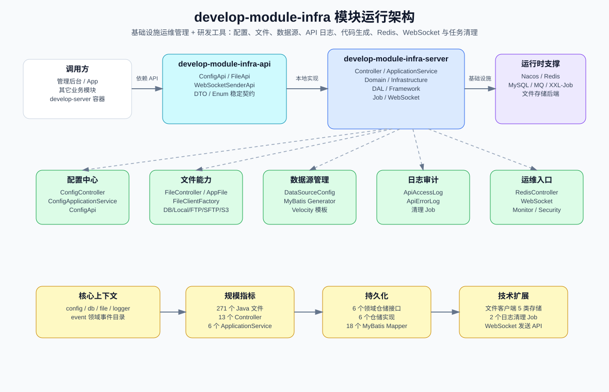
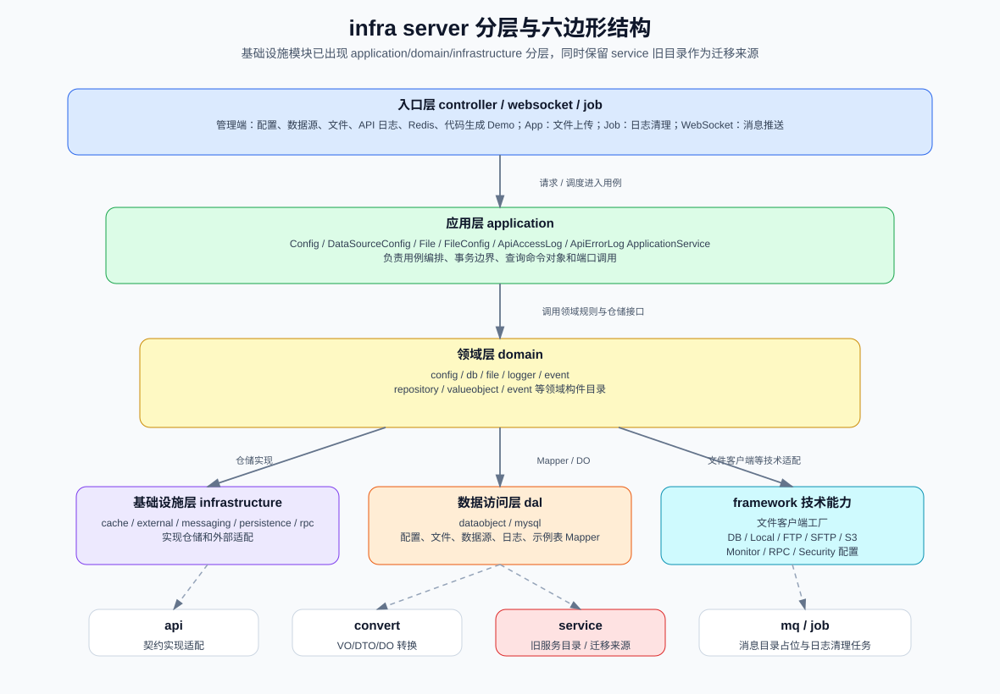
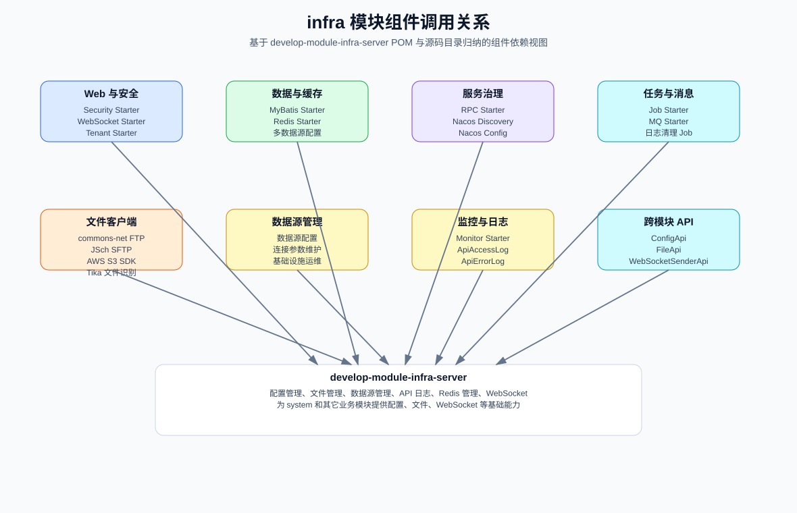
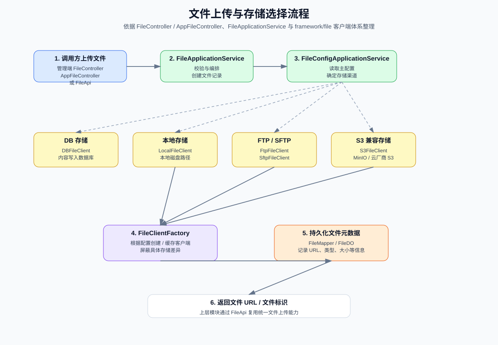
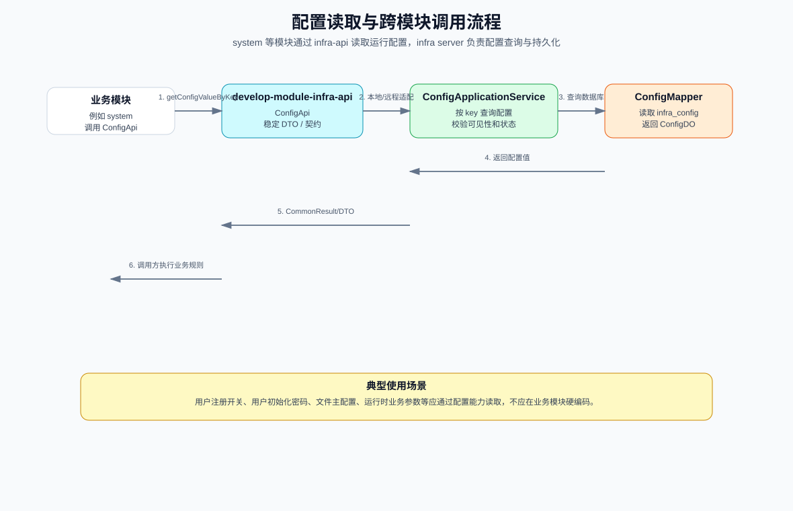
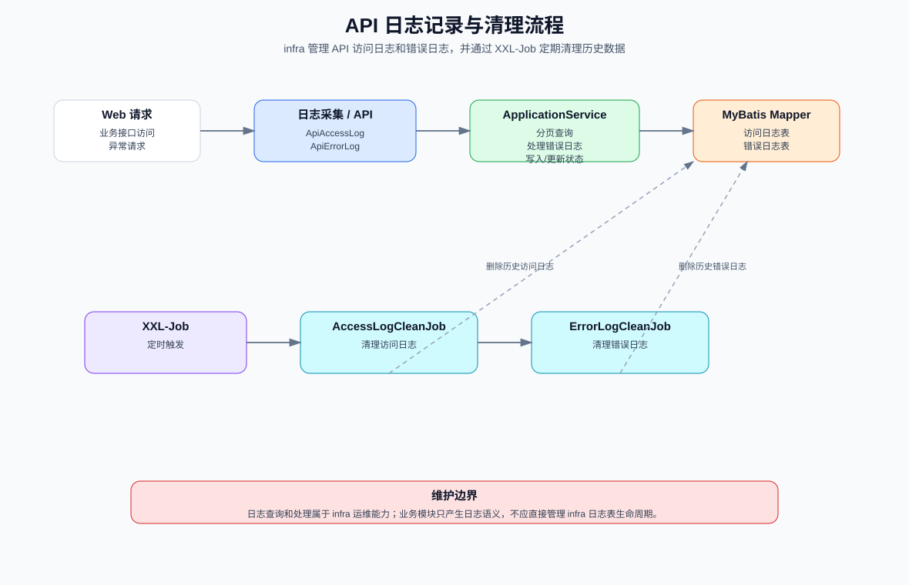
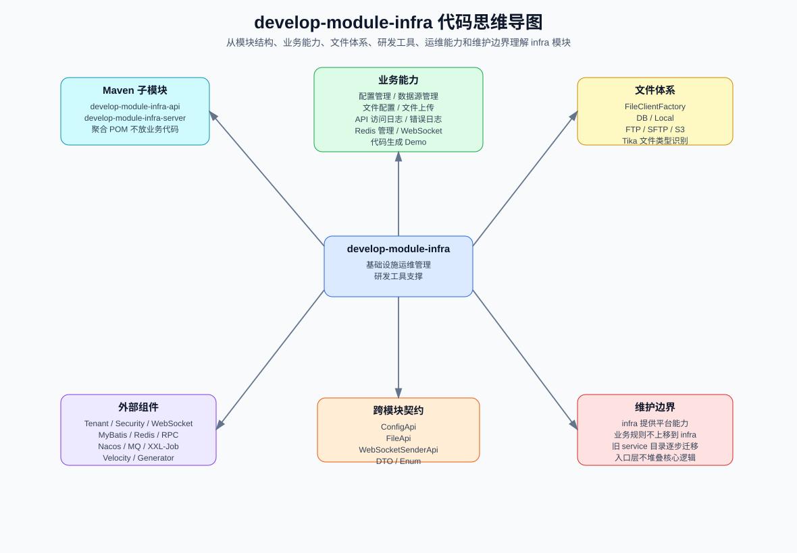

# develop-module-infra

## 1. 模块定位

`develop-module-infra` 是 Smart Cloud 的基础设施与研发工具模块，Maven packaging 为 `pom`，通过 `api + server` 两个子模块对外提供平台级通用能力。

它承担两类职责：一类是配置、文件、数据源、API 日志、Redis、WebSocket、定时清理等基础设施运维能力；另一类是代码生成、Demo 示例等研发效率支撑能力。该模块应服务于 system 和其它业务模块，但不应承载用户、订单、支付、工作流等具体业务规则。

| 子模块 | Packaging | 职责边界 |
|---|---:|---|
| `develop-module-infra-api` | `jar` | 对其它模块暴露稳定契约，包含 `ConfigApi`、`FileApi`、`WebSocketSenderApi`、DTO、枚举等。 |
| `develop-module-infra-server` | `jar` | 承载基础设施业务实现，包含 Controller、ApplicationService、Domain、Infrastructure、DAL、Framework、Job、WebSocket 等。 |

聚合 POM 只负责组织 `api` 与 `server` 子模块，不承载业务代码。

## 2. 阅读导航

| 阅读目标 | 推荐章节 |
|---|---|
| 了解 infra 在整体工程中的职责 | [模块定位](#1-模块定位)、[模块总览架构图](#3-模块总览架构图) |
| 判断 API / server 的职责边界 | [模块定位](#1-模块定位)、[API 契约设计](#8-api-契约设计) |
| 理解 infra server 分层与 DDD 迁移状态 | [分层架构图](#5-分层架构图)、[DDD / 六边形迁移现状](#13-ddd--六边形迁移现状) |
| 查看配置、文件、日志等核心流程 | [文件上传与存储流程图](#9-文件上传与存储流程图)、[配置读取流程图](#10-配置读取流程图)、[API 日志与清理流程图](#11-api-日志与清理流程图) |
| 理解调用方如何舒服接入 infra 能力 | [业务能力边界](#6-业务能力边界)、[API 契约设计](#8-api-契约设计) |
| 修改或验证 infra 模块 | [构建与验证](#14-构建与验证)、[维护建议](#15-维护建议) |

## 3. 模块总览架构图

图 1：infra 位于业务模块与基础设施组件之间，对上输出 API 契约和平台能力，对下适配数据库、Redis、Nacos、MQ、XXL-Job、文件存储和监控体系。



### 架构说明

- `develop-module-infra-api` 是配置、文件、WebSocket 等平台能力的跨模块契约层。
- `develop-module-infra-server` 是基础设施管理与研发工具实现层，可被 `develop-server` 装配为主应用的一部分。
- infra 模块对上支撑 system 和其它业务模块；对下连接数据库、Redis、Nacos、MQ、XXL-Job、文件存储后端和监控体系。
- 文件能力通过 `FileClientFactory` 屏蔽 DB、本地、FTP、SFTP、S3 等存储差异。
- 当前源码同时存在 DDD / 六边形新分层和旧 `service` 目录，后续核心逻辑应逐步收敛到 `application/domain/infrastructure`。

## 4. 基本信息

| 项目 | 内容 |
|---|---|
| 模块路径 | `develop-module-infra` |
| Maven Artifact | `develop-module-infra` |
| Packaging | `pom` |
| 子模块 | `develop-module-infra-api`、`develop-module-infra-server` |
| Java 源文件总数 | 271 |
| API 子模块 Java 文件数 | 12 |
| Server 子模块 Java 文件数 | 259 |
| Controller 数量 | 13 |
| ApplicationService 数量 | 6 |
| 领域上下文数量 | 5 |
| 领域仓储接口数量 | 6 |
| 基础设施仓储实现数量 | 6 |
| MyBatis Mapper 数量 | 18 |
| Job 类数量 | 3 |
| MQ 目录 Java 文件数 | 3 |

## 5. 分层架构图

图 2：infra server 采用入口层、应用层、领域层、基础设施层、数据访问层与模块技术扩展并存的结构；旧 `service` / `dal` 目录仍是迁移来源。



### 分层职责

| 层级 / 目录 | 职责 | 说明 |
|---|---|---|
| `controller` | HTTP 入站适配 | 管理端配置、数据源、文件、日志、Redis、研发 Demo，以及 App 文件上传入口。 |
| `application` | 用例编排 | 配置、数据源、文件、文件配置、访问日志、错误日志等 ApplicationService。 |
| `domain` | 领域层 | 按 config、db、file、logger、event 等上下文组织仓储接口、事件和值对象。 |
| `infrastructure` | 基础设施适配 | persistence、cache、rpc、messaging、external 等技术适配。 |
| `framework` | 模块技术扩展 | 文件客户端、监控、RPC、安全等 infra 专属框架配置与扩展。 |
| `dal` | 数据访问 | 包含 DO、MyBatis Mapper，覆盖配置、数据源、文件、日志、Demo 表等。 |
| `convert` | 对象转换 | 配置、文件、Redis 等 VO / DTO / DO 转换。 |
| `api` | 模块内 API 实现适配 | server 对 infra-api 契约的本地实现或适配入口。 |
| `websocket` | WebSocket 消息 | WebSocket 消息体和推送能力相关结构。 |
| `job` | 定时任务入口 | API 访问日志和错误日志清理任务。 |
| `mq` | 消息目录 | 消息生产、消费或消息体相关目录。 |
| `service` | 旧服务目录 | 当前仍存在的传统三层逻辑目录，是后续 DDD 迁移来源。 |

## 6. 业务能力边界

infra 模块的核心理念是“让调用方用得舒服，但不替调用方写业务逻辑”。infra 负责把配置、文件、WebSocket、日志、Redis、数据源、代码生成等能力封装成稳定服务；调用方负责决定业务规则、业务校验、业务流程和业务语义。

| 设计原则 | 含义 | 对调用方的影响 |
|---|---|---|
| 服务提供者 | infra 提供平台能力和稳定 API。 | 调用方只依赖 `develop-module-infra-api`，不需要理解 infra server 内部实现。 |
| 业务无关 | infra 不写用户、订单、支付、审批等业务判断。 | 调用方拿到配置、文件、推送结果后，自行完成业务决策。 |
| 简单接入 | 高频能力提供清晰契约、DTO 和便捷方法。 | 调用方优先使用 `ConfigApi`、`FileApi`、`WebSocketSenderApi`，避免直接访问 Controller、Mapper 或文件客户端。 |
| 稳定边界 | API 契约稳定，server 实现可演进。 | infra 内部迁移到 DDD / 六边形结构时，调用方代码应尽量不变。 |

当前源码中的主要上下文如下：

| 上下文 / 能力 | 主要职责 | 边界说明 |
|---|---|---|
| `config` | 系统配置管理，向其它模块提供 `ConfigApi` 查询配置值。 | 调用方根据配置值执行业务规则，infra 不替调用方决策业务行为。 |
| `file` | 文件配置、文件上传、文件元数据、文件客户端适配。 | 统一处理存储差异，业务模块不应直接依赖具体存储客户端。 |
| `db` | 数据源配置管理，支撑代码生成和数据库工具能力。 | 面向研发与管理工具，不承载业务数据建模规则。 |
| `logger` | API 访问日志、API 错误日志查询、处理和清理。 | 管理日志生命周期，不替业务模块定义业务审计规则。 |
| `event` | infra 领域事件目录。 | 用于 infra 内部领域事件组织。 |
| `redis` | Redis 管理端入口和 Redis 信息展示。 | 面向运维管理，不应散落业务规则。 |
| `websocket` | WebSocket 消息发送契约和消息结构。 | 对外提供推送能力，业务语义由调用方决定。 |
| `demo` | 代码生成器示例与研发辅助 Demo。 | 属于研发辅助，不属于核心业务规则。 |

## 7. 组件调用关系图

图 3：组件关系图展示 infra server 与框架 Starter、外部组件、跨模块 API 的协作边界。



### 关键依赖

| 依赖 | 用途 |
|---|---|
| `develop-module-infra-api` | 配置、文件、WebSocket 等跨模块契约。 |
| `develop-spring-boot-starter-env` | 环境标识与环境透传能力。 |
| `develop-spring-boot-starter-security` | 管理端接口认证授权与操作日志支撑。 |
| `develop-spring-boot-starter-biz-tenant` | 多租户上下文与租户隔离支撑。 |
| `develop-spring-boot-starter-websocket` | WebSocket 会话与消息推送能力。 |
| `develop-spring-boot-starter-mybatis` | MyBatis Plus、多数据源、分页和数据访问能力。 |
| `mybatis-plus-generator` | 解析数据库表结构，支撑代码生成器。 |
| `develop-spring-boot-starter-redis` | Redis 缓存与 Redis 管理能力。 |
| `develop-spring-boot-starter-rpc` | OpenFeign、负载均衡、跨模块或跨服务调用。 |
| `spring-cloud-starter-alibaba-nacos-discovery` | Nacos 服务注册发现。 |
| `spring-cloud-starter-alibaba-nacos-config` | Nacos 配置中心。 |
| `develop-spring-boot-starter-job` | XXL-Job 定时任务。 |
| `develop-spring-boot-starter-mq` | Redis / RabbitMQ / RocketMQ / Kafka 消息抽象。 |
| `develop-spring-boot-starter-excel` | 导入导出能力。 |
| `develop-spring-boot-starter-monitor` | 链路追踪、指标和监控接入。 |
| `develop-spring-boot-starter-test` | 测试基类、随机对象、断言与测试工具。 |
| `velocity-engine-core` | 代码生成模板渲染。 |
| `commons-net` | FTP 文件客户端。 |
| `jsch` | SFTP 文件客户端。 |
| `software.amazon.awssdk:s3` | S3 兼容文件存储客户端。 |
| `tika-core` | 文件类型识别。 |

## 8. API 契约设计

`develop-module-infra-api` 面向其它模块暴露配置、文件和 WebSocket 能力。API 子模块应保持轻量、稳定，不依赖 server 内部实现。

| 契约 | 代表类 | 职责 |
|---|---|---|
| 配置 API | `ConfigApi` | 按 key 查询配置值，供 system 等模块读取运行配置。 |
| 文件 API | `FileApi` | 创建文件并返回文件访问地址或标识。 |
| WebSocket API | `WebSocketSenderApi` | 向指定用户、租户或会话发送 WebSocket 消息。 |
| 文件 DTO | `FileCreateReqDTO` | 文件创建请求数据。 |
| WebSocket DTO | `WebSocketSendReqDTO` | WebSocket 推送请求数据。 |
| 枚举常量 | `ApiConstants`、`DictTypeConstants`、`ErrorCodeConstants` | infra 模块 API 前缀、字典类型和错误码。 |

### 调用方接入原则

调用方应把 infra API 当作“基础服务入口”，而不是业务流程入口。推荐用法如下：

| 能力 | 推荐入口 | infra 负责 | 调用方负责 |
|---|---|---|---|
| 配置读取 | `ConfigApi#getConfigValueByKey(String key)` | 按 key 返回配置值。 | 解释配置含义，并决定是否允许注册、是否启用某个业务流程等。 |
| 文件创建 | `FileApi#createFile(...)` | 保存文件内容，返回访问路径；按配置选择 DB、本地、FTP、SFTP、S3 等存储。 | 判断谁能上传、文件属于哪个业务对象、上传后如何进入业务流程。 |
| 文件预签名 | `FileApi#presignGetUrl(String url, Integer expirationSeconds)` | 基于完整文件地址生成读取用预签名地址。 | 判断该用户是否有权限读取该业务文件。 |
| WebSocket 推送 | `WebSocketSenderApi#send(...)` / `sendObject(...)` | 将消息发送到指定用户、用户类型或 Session。 | 决定消息类型、消息内容、触发时机和接收对象。 |

设计约束：

- API 子模块不得依赖 server 内部实现类。
- 配置、文件、WebSocket 等平台能力应通过 API 契约复用，避免业务模块直接访问 infra 内部表或实现类。
- API 方法命名应表达基础设施能力，不应编码调用方业务语义。
- DTO 字段应描述平台服务所需参数，不应混入订单、支付、审批等业务对象概念。
- 修改 API 契约时必须检查 system、server 容器和其它业务模块的兼容性。
- 涉及远程调用时，应同步检查 local / remote 适配器和 Feign 契约。

## 9. 文件上传与存储流程图

图 4：文件能力由业务入口、应用服务、文件配置和文件客户端体系共同组成，通过工厂屏蔽不同存储渠道。



### 文件体系设计

| 类型 | 代表代码 | 职责 |
|---|---|---|
| 管理端入口 | `FileController`、`FileConfigController` | 管理文件和文件配置。 |
| App 入口 | `AppFileController` | 用户端文件上传入口。 |
| 应用服务 | `FileApplicationService`、`FileConfigApplicationService` | 编排文件上传、配置读取、元数据保存。 |
| 客户端工厂 | `FileClientFactory`、`FileClientFactoryImpl` | 根据文件配置创建并缓存具体文件客户端。 |
| 抽象客户端 | `FileClient`、`AbstractFileClient` | 屏蔽不同存储后端差异。 |
| DB 存储 | `DBFileClient`、`DBFileClientConfig` | 将文件内容保存到数据库。 |
| 本地存储 | `LocalFileClient`、`LocalFileClientConfig` | 将文件保存到本地磁盘。 |
| FTP / SFTP | `FtpFileClient`、`SftpFileClient` | 对接 FTP 或 SFTP 文件服务器。 |
| S3 存储 | `S3FileClient`、`S3FileClientConfig` | 对接 MinIO 或云厂商 S3 兼容存储。 |
| 文件识别 | `FileTypeUtils` | 基于 Tika 等能力识别文件类型。 |

维护边界：业务模块只应通过 `FileApi` 或文件入口复用文件能力，不应直接依赖具体文件客户端实现。

## 10. 配置读取流程图

图 5：配置能力通过 `develop-module-infra-api` 对外暴露，infra server 负责配置查询与持久化，调用方负责自身业务决策。



### 典型场景

system 模块中的用户注册开关、初始化密码等运行参数会通过 `develop-module-infra-api` 的 `ConfigApi` 读取，而不是在业务模块硬编码。配置能力的边界如下：

1. 调用方依赖 `develop-module-infra-api`。
2. 调用 `ConfigApi` 按 key 获取配置值。
3. infra server 通过 `ConfigApplicationService` 编排配置查询。
4. `ConfigMapper` 读取配置数据。
5. 调用方根据配置值执行自身业务规则。

代表性代码：

| 能力 | 代码位置 |
|---|---|
| 配置 API | `develop-module-infra-api/src/main/java/com/develop/mvp/pk/module/infra/api/config/ConfigApi.java` |
| 配置应用服务 | `develop-module-infra-server/src/main/java/com/develop/mvp/pk/module/infra/application/config/service/ConfigApplicationService.java` |
| 配置 Controller | `develop-module-infra-server/src/main/java/com/develop/mvp/pk/module/infra/controller/admin/config/ConfigController.java` |
| 配置 Mapper | `develop-module-infra-server/src/main/java/com/develop/mvp/pk/module/infra/dal/mysql/config/ConfigMapper.java` |

## 11. API 日志与清理流程图

图 6：API 日志能力覆盖访问日志、错误日志查询处理，以及 XXL-Job 定时清理入口。



### 日志能力边界

| 类型 | 代表代码 | 职责 |
|---|---|---|
| API 访问日志入口 | `ApiAccessLogController` | 管理端查询 API 访问日志。 |
| API 错误日志入口 | `ApiErrorLogController` | 管理端查询和处理 API 错误日志。 |
| 访问日志应用服务 | `ApiAccessLogApplicationService` | 编排访问日志查询与清理。 |
| 错误日志应用服务 | `ApiErrorLogApplicationService` | 编排错误日志查询、处理与清理。 |
| 访问日志清理任务 | `AccessLogCleanJob` | 定时清理历史访问日志。 |
| 错误日志清理任务 | `ErrorLogCleanJob` | 定时清理历史错误日志。 |

维护边界：日志生命周期管理属于 infra 运维能力；其它业务模块只产生日志语义，不应直接管理 infra 日志表。

## 12. 代码思维导图

图 7：思维导图从模块结构、平台能力、文件体系、跨模块契约、外部组件和维护边界理解 infra。



## 13. DDD / 六边形迁移现状

infra server 当前同时存在 DDD / 六边形目录和传统 `service` 目录：

```text
develop-module-infra-server/src/main/java/com/develop/mvp/pk/module/infra/
├── controller/        # HTTP 入站适配
├── application/       # command、query、dto、port、ApplicationService
├── domain/            # config、db、file、logger、event 等领域目录
├── infrastructure/    # cache、external、messaging、persistence、rpc 适配
├── framework/         # 文件客户端、监控、RPC、安全等模块技术能力
├── convert/           # 对象转换
├── dal/               # DO、MyBatis Mapper
├── api/               # server 内部 API 适配实现
├── websocket/         # WebSocket 消息结构
├── job/               # 日志清理 Job
├── mq/                # MQ 目录结构
└── service/           # 旧服务目录，后续迁移来源
```

后续迁移或新增代码时应遵循：

- 新增核心规则优先进入 `application/domain/infrastructure`，不要继续沉淀到旧 `service` 目录。
- `domain` 保持纯 Java，承载聚合根、值对象、领域服务、领域事件和仓储接口。
- `application` 负责编排用例、事务边界和领域对象协作。
- `infrastructure` 负责仓储实现、MyBatis / Redis / 外部系统适配。
- 文件客户端属于技术适配层，业务用例应依赖抽象能力而不是具体存储实现。
- 配置、文件、WebSocket 是平台契约能力，应通过 API 子模块暴露给其它模块。
- `controller`、`job`、`websocket` 只作为入口层，不承载复杂业务规则。
- `dal` 只负责数据访问，规则判断应位于应用层或领域层。

### 源码职责注释策略

职责注释用于说明包、层或边界的“为什么存在”和“不能做什么”，不用于复述类名、方法名或字段名。

- 优先在 README、模块根包和关键分层包的 `package-info.java` 说明职责边界。
- `application`、`domain`、`infrastructure`、`dal`、`service` 等迁移边界清晰的包应保留职责说明。
- DTO、VO、DO、Mapper、Convert、普通枚举和简单请求响应对象不做机械注释。
- 当代码职责已经由类名、方法名和分层位置清楚表达时，不额外添加注释。
- 新增注释必须说明维护边界、依赖方向或迁移约束，避免写成实现步骤说明。

## 14. 构建与验证

在仓库根目录执行以下命令验证 infra 聚合模块或指定子模块：

```bash
# 编译 infra 聚合模块及依赖
mvn compile -pl develop-module-infra -am

# 编译 infra api 及依赖
mvn compile -pl develop-module-infra/develop-module-infra-api -am

# 编译 infra server 及依赖
mvn compile -pl develop-module-infra/develop-module-infra-server -am

# 运行 infra server 测试
mvn test -pl develop-module-infra/develop-module-infra-server

# 打包 infra 聚合模块及依赖
mvn clean package -pl develop-module-infra -am -Dmaven.test.skip=true
```

说明：仓库未提供 Maven Wrapper，请使用本地 `mvn`，并确保使用 Java 17。

## 15. 维护建议

- 修改跨模块契约时，优先修改 `develop-module-infra-api`，并检查 system 与其它调用方兼容性。
- 设计新的 infra API 时，应优先让调用方少理解内部细节，但不得把调用方业务规则下沉到 infra。
- 修改文件存储能力时，必须确认不同 `FileStorageEnum` 对应客户端的行为边界，不要把渠道差异泄漏到业务模块。
- 修改配置能力时，确认调用方是否依赖配置 key 的语义和默认值。
- 修改日志清理任务时，确认保留周期、删除条件和运维排查需求。
- 修改代码生成或数据源管理能力时，确认其定位仍是研发工具，不要把业务建模规则固化到 infra。
- 涉及 DDD 分层、模块结构或 API 契约调整时，同步更新本文档和根目录架构文档。
- 修改 SVG 图时优先更新 `develop-module-infra/generate_infra_readme_svgs.py` 后重新生成，避免手工改图导致脚本与图片不一致。
