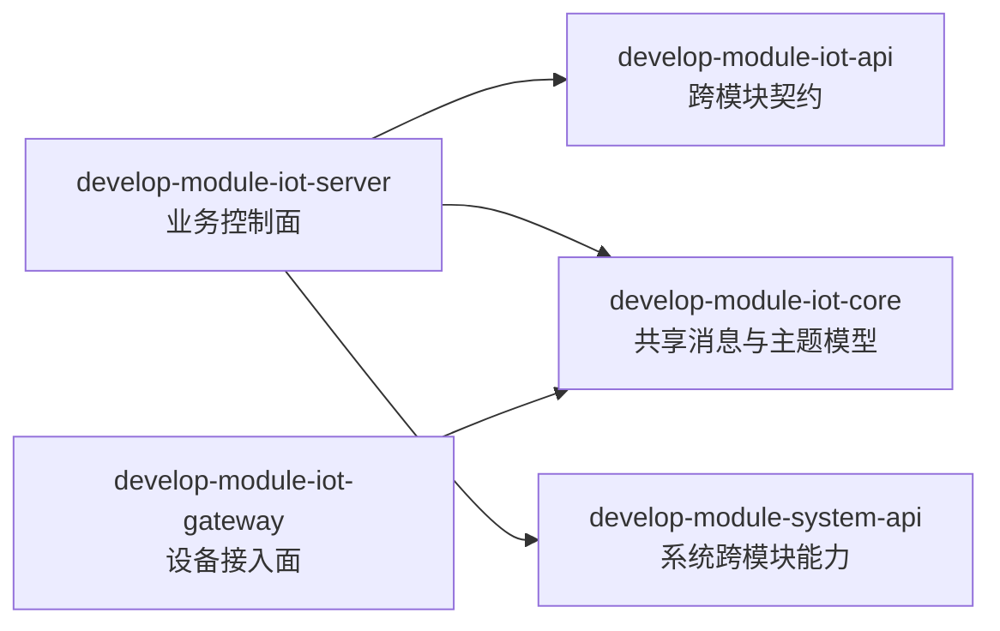
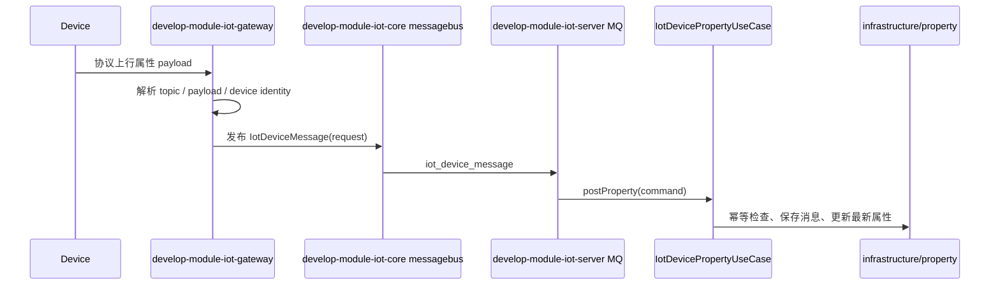
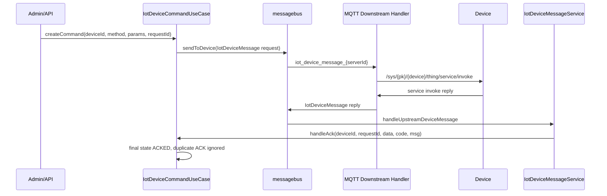
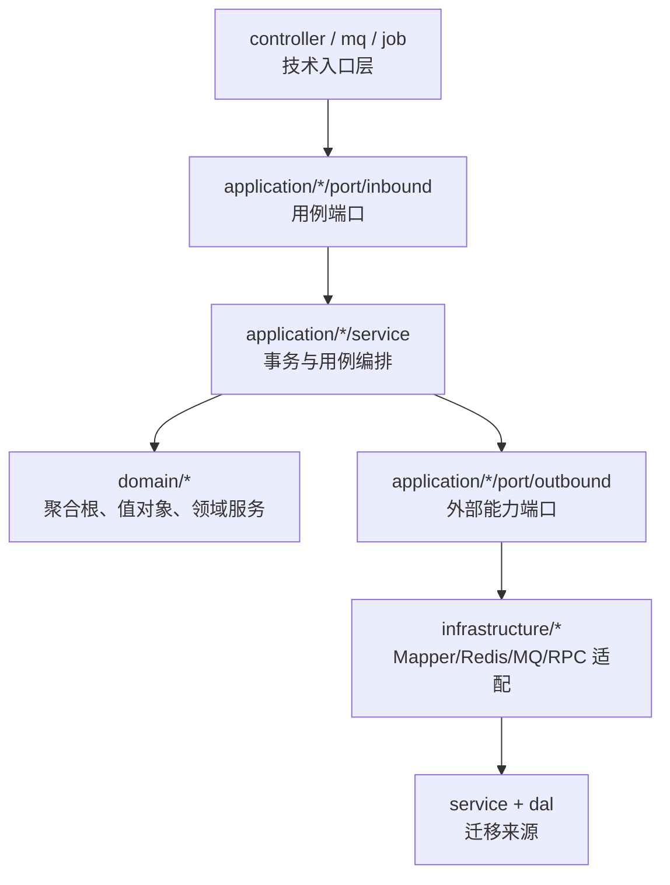

# develop-module-iot

`develop-module-iot` 是 Smart Cloud 的物联网业务域，负责产品、物模型、设备、设备消息、设备属性、命令下发、协议接入与网关转发等 IoT 能力。当前模块正在按仓库 DDD / Hexagonal-Lite 标准收口，目标是基于现有四模块结构逐步形成可验证、可扩展、可运维的 IoT 生产闭环。

## 1. 模块定位

IoT 模块不是单一运行单元，而是由一个 Maven 聚合模块和三个业务子运行边界组成：

- `develop-module-iot`：Maven 聚合模块，只负责组织子模块构建，不放业务代码。
- `develop-module-iot-api`：跨模块稳定契约层，承载 CommonApi、DTO、local/remote 适配目录。
- `develop-module-iot-core`：IoT server 与 gateway 之间的迁移期共享能力，承载消息总线、设备消息、主题 DTO、序列化相关基础类型。
- `develop-module-iot-server`：业务控制面，承载产品、物模型、设备、属性、消息、命令等业务用例与持久化适配。
- `develop-module-iot-gateway`：设备接入面，承载 MQTT/HTTP/Modbus/CoAP 等协议接入、连接会话、消息标准化和下行命令转发。

P0 阶段优先保证最小生产闭环可运行：注册产品、发布物模型、注册设备、设备上线、属性上报、查询最新状态、下发命令、设备 ACK、查询命令状态。

## 2. 四模块职责边界

| 模块 | 职责 | 不应承担 |
|---|---|---|
| `develop-module-iot` | Maven 聚合、统一构建、子模块声明 | Controller、Service、Domain、Mapper、业务配置 |
| `develop-module-iot-api` | 跨模块稳定契约、DTO、CommonApi、local/remote 适配包 | 业务编排、数据库访问、MQ 消费、协议解析 |
| `develop-module-iot-core` | 迁移期共享消息模型、主题模型、messagebus producer、topic DTO | 产品/物模型/命令状态最终裁决、数据库写入、控制面业务规则 |
| `develop-module-iot-server` | 业务控制面、DDD 聚合、应用用例、仓储适配、管理端 Controller、MQ 消费 | 设备长连接维护、协议底层编解码、网关会话路由 |
| `develop-module-iot-gateway` | 设备接入、认证参数提取、协议编解码、连接管理、上行标准化、下行转发 | 直接写业务库、裁决产品发布规则、最终更新命令状态 |

## 3. Maven 接入状态

IoT 自身是独立 Maven 聚合模块，子模块声明位于 `develop-module-iot/pom.xml`：

```text
develop-module-iot/
  develop-module-iot-api/
  develop-module-iot-core/
  develop-module-iot-server/
  develop-module-iot-gateway/
```

稳定验证入口建议始终使用 IoT 聚合 POM，不依赖根 `pom.xml` 是否已把 IoT 纳入默认 reactor：

```bash
# 编译 IoT 四个子模块，跳过测试
mvn -f develop-module-iot/pom.xml compile -DskipTests

# 运行 API 模块测试
mvn -f develop-module-iot/pom.xml -pl develop-module-iot-api test

# 运行 Core 模块测试
mvn -f develop-module-iot/pom.xml -pl develop-module-iot-core test

# 运行 Server 模块测试
mvn -f develop-module-iot/pom.xml -pl develop-module-iot-server test

# 运行 Gateway 模块测试，并同时构建依赖模块，避免使用本地仓库旧 artifact
mvn -f develop-module-iot/pom.xml -pl develop-module-iot-gateway -am test

# 运行 MVP 生产闭环测试
mvn -f develop-module-iot/pom.xml -pl develop-module-iot-server test -Dtest=IotMvpFlowIntegrationTest
```

根 reactor 是否包含 `develop-module-iot` 由根目录 `pom.xml` 的 `<modules>` 决定。修改根 reactor 或把 `develop-module-iot-server` 接入 `develop-server` 属于最终集成决策，应在 IoT P0 测试全部通过后单独处理。

## 4. DDD 分层规则

`develop-module-iot-server` 正在从旧三层结构迁移到 DDD / Hexagonal-Lite。新增或迁移核心业务必须使用以下边界：

```text
com.develop.mvp.pk.module.iot
  domain/{aggregate}/
    model/          # 聚合根与领域对象
    valueobject/    # 值对象
    event/          # 领域事件
    service/        # 领域服务
    repository/     # 仓储接口
  application/{aggregate}/
    command/        # 写用例命令
    query/          # 查询用例参数
    result/         # 应用结果对象
    port/inbound/   # Controller、MQ、Job、Gateway 等入口调用的用例端口
    port/outbound/  # 应用层依赖的外部能力端口
    service/        # 应用服务、事务边界、用例编排
  infrastructure/{aggregate}/
    persistence/    # MyBatis/DO/Mapper 仓储实现
    cache/          # Redis/本地缓存适配
    messaging/      # MQ/messagebus 适配
    external/       # 外部系统适配
    rpc/            # 跨模块或远程 RPC 适配
```

强制规则：

1. `domain` 必须保持纯 Java，不依赖 Spring、MyBatis、Redis、MQ、HTTP、Controller VO、DO、Mapper。
2. Repository 接口定义在 `domain`，技术实现放在 `infrastructure`。
3. Controller、MQ Consumer、Job、WebSocket、Gateway 桥接入口只能调用 ApplicationService 或 inbound port。
4. `service`、`dal` 是迁移来源，不是新增核心业务规则的最终位置。
5. 行为兼容优先。重构只改变调用边界，不主动改变 HTTP/RPC/MQ/协议字段语义。

当前 P0 已落地的主要应用边界包括：

| 聚合/能力 | Inbound Port | Application Service |
|---|---|---|
| Product | `application/product/port/inbound/IotProductUseCase` | `application/product/service/IotProductApplicationService` |
| ThingModel | `application/thingmodel/port/inbound/IotThingModelUseCase` | `application/thingmodel/service/IotThingModelApplicationService` |
| Device | `application/device/port/inbound/IotDeviceUseCase` | `application/device/service/IotDeviceApplicationService` |
| Property | `application/property/port/inbound/IotDevicePropertyUseCase` | `application/property/service/IotDevicePropertyApplicationService` |
| Command | `application/command/port/inbound/IotDeviceCommandUseCase` | `application/command/service/IotDeviceCommandApplicationService` |

## 5. API 契约规则

`develop-module-iot-api` 采用“一套稳定契约 + local/remote 适配目录”的模块 API 策略。当前 P0 已补齐以下 CommonApi 包：

```text
com.develop.mvp.pk.module.iot.api.product.IotProductCommonApi
com.develop.mvp.pk.module.iot.api.thingmodel.IotThingModelCommonApi
com.develop.mvp.pk.module.iot.api.device.IotDeviceCommonApi
com.develop.mvp.pk.module.iot.api.command.IotDeviceCommandCommonApi
```

每个 API 能力按以下目录组织：

```text
api/{capability}/
  Iot...CommonApi.java
  dto/
  local/package-info.java
  remote/package-info.java
```

约束：

- API DTO 不允许依赖 Controller VO、DO、Mapper、Domain、Redis、MQ message。
- API 契约字段必须稳定，避免直接暴露内部持久化结构。
- `develop-module-iot-core` 中历史 `core.biz.IotDeviceCommonApi` 仍需保持兼容，P0 不删除、不重命名。
- local/remote 适配的选择属于运行集成策略，不应让调用方感知两套业务语义。

## 6. Gateway 协议边界

`develop-module-iot-gateway` 是设备接入运行单元，当前重点路径是 MQTT 下行命令与 ACK 桥接。Gateway 的职责是把协议世界转换成标准 IoT messagebus 世界：

- 维护设备连接与 `serverId` / session / deviceId 关系。
- 解析设备上行 topic 和 payload，生成 `IotDeviceMessage`。
- 订阅 server 下行消息，按设备连接路由到协议 topic。
- 接收设备 ACK，转换为 server 可处理的 reply message。

Gateway 不负责：

- 直接更新产品、物模型、命令最终状态。
- 直接访问业务 Mapper、DO、Redis、TDengine。
- 执行完整物模型业务校验。
- 绕过 server 应用用例写入业务结果。

当前 MQTT 服务调用下行 topic：

```text
/sys/{productKey}/{deviceName}/thing/service/invoke
```

下行请求参数 DTO：

```java
IotDeviceServiceInvokeReqDTO(
    String identifier,
    Map<String, Object> inputParams,
    String commandId,
    String traceId,
    Integer schemaVersion
)
```

服务调用 ACK 响应 DTO：

```java
IotDeviceServiceInvokeRespDTO(
    String commandId,
    String traceId,
    Integer schemaVersion,
    Map<String, Object> outputParams
)
```

## 7. MVP 生产闭环

P0 的最小生产闭环由 `IotMvpFlowIntegrationTest` 覆盖，测试路径位于：

```text
develop-module-iot/develop-module-iot-server/src/test/java/com/develop/mvp/pk/module/iot/mvp/IotMvpFlowIntegrationTest.java
```

闭环步骤：

```text
1. create product
2. create thing model
3. publish product
4. register device
5. mark device online
6. post property
7. query latest property
8. create command
9. simulate gateway delivery
10. ACK command
11. duplicate ACK idempotency check
12. query ACKED command status
```

验收信号：

| 步骤 | 期望结果 |
|---|---|
| 注册产品 | 返回 productId，可查询产品结果 |
| 创建/发布物模型 | TSL 中能查询到属性定义 |
| 注册设备 | 返回 deviceId，设备可进入 ONLINE 状态 |
| 属性上报 | 最新属性中出现上报 identifier 和 value |
| 命令下发 | message port 记录 requestId 已投递 |
| 设备 ACK | 命令状态变为 ACKED |
| 重复 ACK | 不重复记录副作用，最终状态保持 ACKED |

## 8. MQ / messagebus 主题与消息字段

IoT 共享消息类型：

```text
com.develop.mvp.pk.module.iot.core.mq.message.IotDeviceMessage
```

核心字段：

| 字段 | 含义 |
|---|---|
| `id` | 消息 ID，用于幂等和索引 |
| `reportTime` | 设备上报或消息创建时间 |
| `deviceId` | 平台设备 ID |
| `tenantId` | 租户 ID |
| `serverId` | Gateway / Server 标识，用于路由下行消息 |
| `requestId` | 请求-响应关联 ID |
| `method` | 物模型方法，如属性上报、服务调用 |
| `params` | 请求参数 |
| `data` | 响应数据 |
| `code` | 响应码 |
| `msg` | 响应消息 |

核心主题：

```java
IotDeviceMessage.MESSAGE_BUS_DEVICE_MESSAGE_TOPIC = "iot_device_message"
IotDeviceMessage.MESSAGE_BUS_GATEWAY_DEVICE_MESSAGE_TOPIC = "iot_device_message_%s"
```

消息方向：

- 上行：Gateway 标准化设备消息后发送到 server 侧 `iot_device_message`。
- 下行：Server 创建命令消息后按 `serverId` 投递到 gateway 专属 topic。
- ACK：Gateway 将设备 reply 标准化为 `IotDeviceMessage` reply，server 根据 `requestId` 路由到命令 ACK 用例。

## 9. 数据存储与索引原则

当前 IoT server 仍处于新 DDD 层与旧 `service/dal` 共存阶段，存储原则如下：

| 数据 | 当前原则 |
|---|---|
| 产品 | Product 聚合通过仓储接口读写，基础设施适配旧 DO/Mapper |
| 物模型 | ThingModel 聚合保留现有字段语义，发布限制遵循旧产品状态规则 |
| 设备 | Device 聚合封装注册、状态更新、分页查询等主要用例，部分兼容路径仍调用旧 service |
| 属性 | Property 应用服务负责幂等、最新属性写入和查询；基础设施适配持久化/缓存能力 |
| 命令 | 现阶段以设备消息日志作为命令请求与 reply 的事实来源，不额外引入独立命令表 |
| 消息 | `IotDeviceMessage` 保留 request/reply 结构，用于上行消息、下行命令、ACK 关联 |

索引与幂等建议：

- 设备消息按 `deviceId + requestId + reply` 查询请求与响应。
- 属性上报幂等按 `messageId + productId + deviceId` 判断。
- 命令 ACK 幂等由命令状态机保证，`ACKED/FAILED/TIMEOUT/CANCELED` 为最终态。
- 日志中避免打印原始 `deviceSecret`，排障时使用 deviceId、productKey、deviceName、requestId、messageId、traceId。

## 10. 架构图

### 10.1 IoT 四模块依赖图



### 10.2 设备上行链路图



### 10.3 命令下行与 ACK 链路图



### 10.4 Server DDD 分层图



## 11. 测试与验证命令

推荐按修改范围选择最小验证命令，再补充跨模块 compile：

| 修改范围 | 验证命令 |
|---|---|
| API 契约 | `mvn -f develop-module-iot/pom.xml -pl develop-module-iot-api test` |
| Core 消息/主题 | `mvn -f develop-module-iot/pom.xml -pl develop-module-iot-core test` |
| Server 应用/领域/仓储 | `mvn -f develop-module-iot/pom.xml -pl develop-module-iot-server test` |
| Gateway 协议 | `mvn -f develop-module-iot/pom.xml -pl develop-module-iot-gateway -am test` |
| MVP 闭环 | `mvn -f develop-module-iot/pom.xml -pl develop-module-iot-server test -Dtest=IotMvpFlowIntegrationTest` |
| IoT 聚合编译 | `mvn -f develop-module-iot/pom.xml compile -DskipTests` |

运行带通配符的 Maven 测试参数时，zsh 下需要给 `-Dtest` 加引号：

```bash
mvn -f develop-module-iot/pom.xml -pl develop-module-iot-server test "-Dtest=*Command*Test"
```

当使用 `-am` 且上游模块没有匹配指定测试时，可按需增加：

```bash
-Dsurefire.failIfNoSpecifiedTests=false
```

## 12. AI Coding 执行约束

后续 AI Coding 任务必须遵守：

1. 修改任何 DDD 聚合前，先读取对应 `.claude/ddd-skills/AggregateRoot_Iot*_Skill.md`。
2. 每个行为变更先写失败测试，再写最小实现，再运行验证。
3. 每次只处理一个聚合或一条链路，不批量迁移无关业务。
4. 保持 HTTP path、HTTP method、权限注解、VO 字段、RPC DTO、MQ topic、payload 字段兼容。
5. 不在 `domain` 中引入 Spring、Mapper、DO、Redis、MQ、HTTP 类型。
6. 不绕过 Application inbound port 让 Controller/MQ/Gateway 直接调用 Mapper。
7. 不修改根 reactor 或 `develop-server` 集成状态，除非任务明确进入最终集成阶段。
8. 不删除历史兼容逻辑、兜底逻辑或旧 service 路径，除非已有测试证明安全且迁移任务明确要求。
9. 遇到设备认证、租户隔离、命令幂等、ACK 覆盖、协议字段语义不明确时停止并先补事实源。

## 13. 运维与排障要点

| 场景 | 排查入口 | 关键字段 |
|---|---|---|
| 设备无法上线 | Gateway 连接管理、设备认证适配、server 设备状态用例 | productKey、deviceName、deviceId、serverId |
| 属性上报未更新 | Gateway 上行解析、`iot_device_message`、Property UseCase、property storage adapter | messageId、requestId、method、deviceId |
| 命令未送达 | Command UseCase、messagebus gateway topic、Gateway connection manager | requestId、serverId、deviceId、topic |
| ACK 未更新状态 | Gateway reply 标准化、`IotDeviceMessageServiceImpl`、Command UseCase | requestId、reply flag、code、msg |
| 重复消息 | Property 幂等、Command final state | messageId、deviceId、requestId |
| 编译找不到新 DTO 构造器 | 是否使用 `-am` 构建依赖模块，是否误用本地仓库旧 artifact | Maven reactor、module artifact version |

排障原则：

- 先确认消息是否进入 Gateway，再确认是否进入 Core messagebus，最后确认是否进入 Server application port。
- 下行命令优先按 `requestId` 串联 server request、gateway delivery、device reply、server ACK。
- Gateway 只证明投递与协议转换，不证明业务最终状态；最终状态以 server command use case 查询为准。
- 对外日志避免输出明文密钥，尤其是 `deviceSecret`。
- 如果 Maven root reactor 与 IoT 聚合独立构建结果不一致，先用 `mvn -f develop-module-iot/pom.xml ...` 定位 IoT 自身问题，再处理根集成。 
