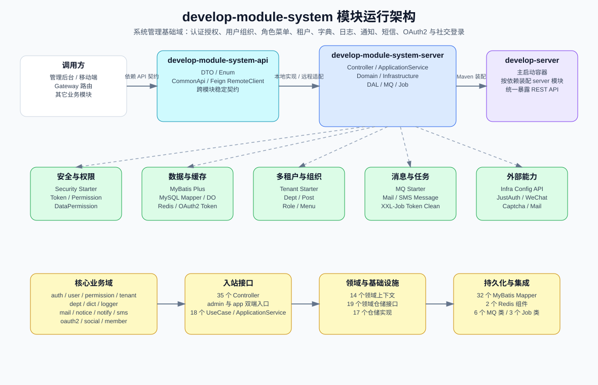
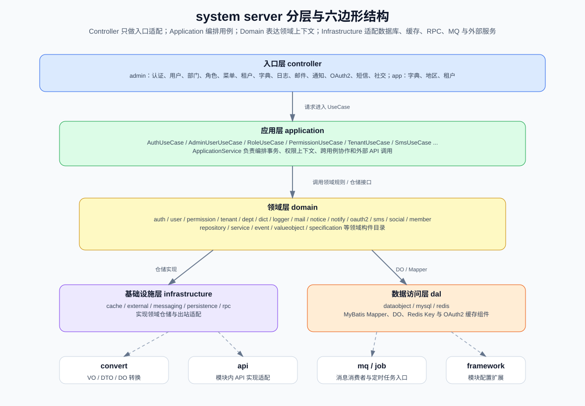
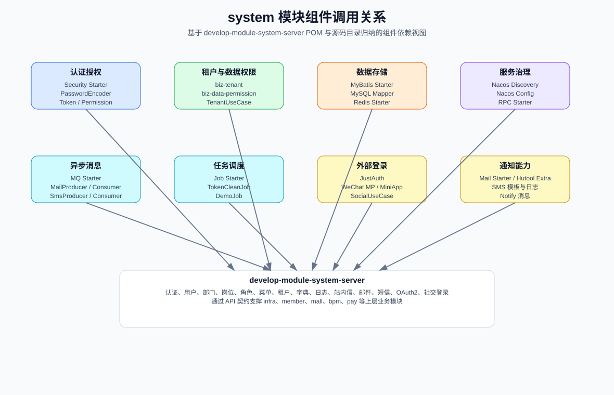
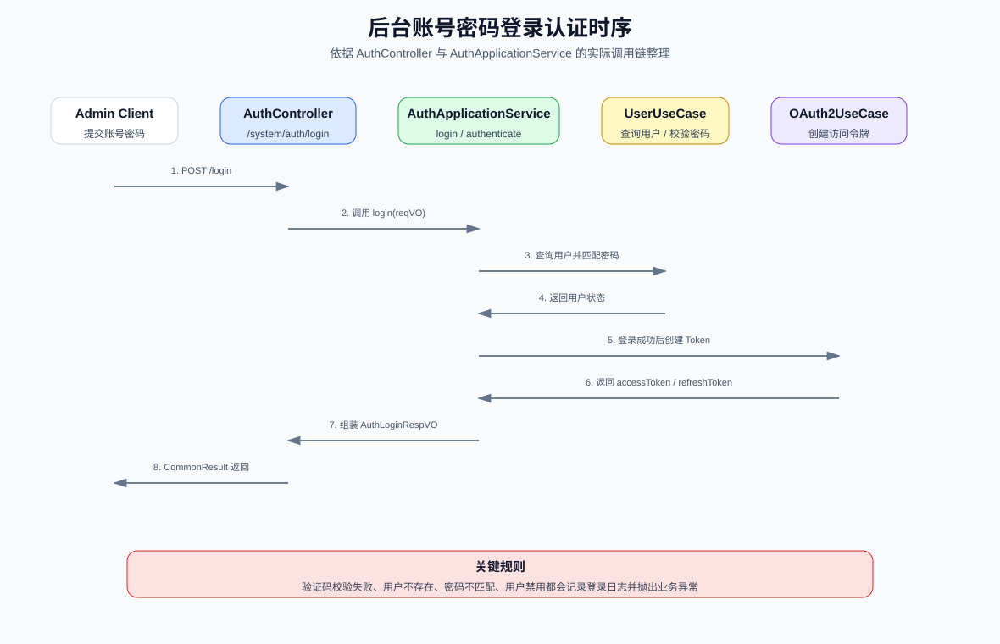
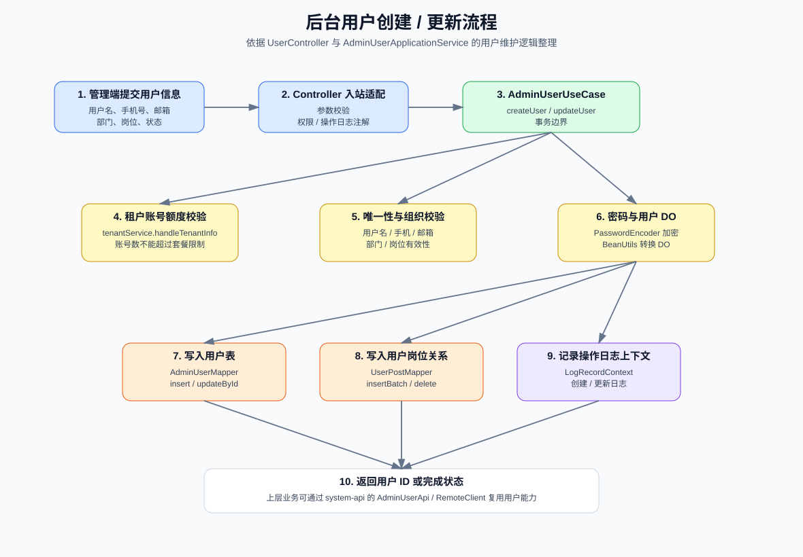
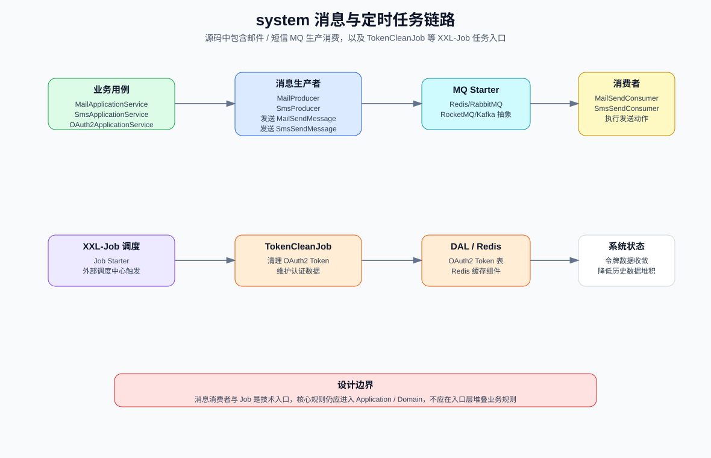
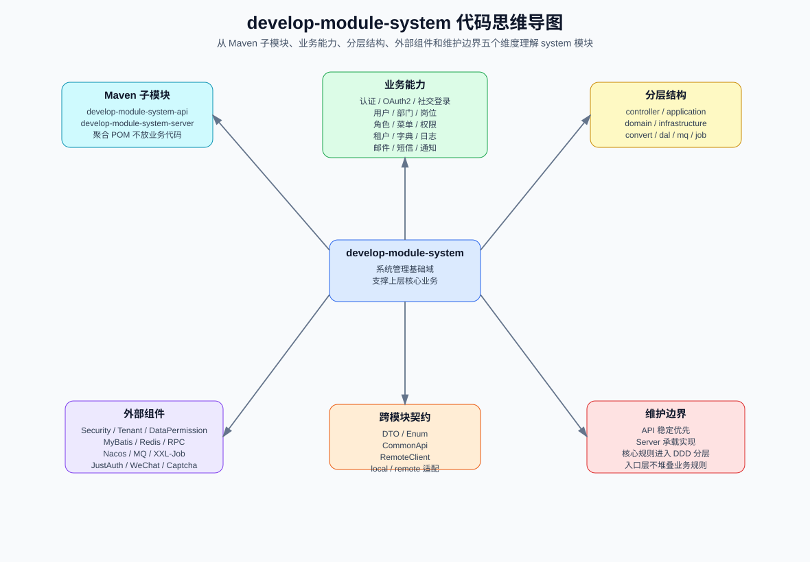

# develop-module-system

## 1. 模块定位

`develop-module-system` 是 Smart Cloud 的系统管理基础域，提供后台管理和上层业务模块共同依赖的通用能力，包括认证授权、用户组织、角色菜单、租户、数据字典、登录与操作日志、站内通知、邮件、短信、OAuth2、社交登录等。

该模块采用 `api + server` 的 Maven 子模块结构：

| 子模块 | Packaging | 职责 |
|---|---:|---|
| `develop-module-system-api` | `jar` | 对其它模块暴露稳定契约，包含 DTO、枚举、CommonApi / RemoteClient 等跨模块调用接口。 |
| `develop-module-system-server` | `jar` | 承载系统管理业务实现，包含 Controller、ApplicationService、Domain、Infrastructure、DAL、MQ、Job 等。 |

模块聚合 POM 只负责组织 `api` 与 `server` 子模块，不承载业务代码。

## 2. 模块总览架构图



### 架构说明

- `develop-module-system-api` 是跨模块契约层，其它业务模块应优先依赖该子模块，而不是直接依赖 `server` 实现。
- `develop-module-system-server` 是业务实现层，可被 `develop-server` 作为 Maven 依赖装配进主启动容器。
- system 模块向上支撑管理后台、移动端和其它业务模块；向下依赖安全、租户、数据权限、MyBatis、Redis、RPC、Nacos、MQ、XXL-Job、邮件、短信、验证码、社交登录等基础组件。
- 当前源码已具备 DDD / 六边形分层目录，`controller` 负责入口适配，`application` 负责编排用例，`domain` 表达领域上下文，`infrastructure` 负责技术适配。

## 3. 基本信息

| 项目 | 内容 |
|---|---|
| 模块路径 | `develop-module-system` |
| Maven Artifact | `develop-module-system` |
| Packaging | `pom` |
| Java 源文件总数 | 753 |
| API 子模块 Java 文件数 | 72 |
| Server 子模块 Java 文件数 | 681 |
| Controller 数量 | 35 |
| ApplicationService 数量 | 18 |
| 领域上下文数量 | 14 |
| 领域仓储接口数量 | 19 |
| 基础设施仓储实现数量 | 17 |
| MyBatis Mapper 数量 | 32 |

## 4. 分层架构图



### 分层职责

| 层级 / 目录 | 职责 | 说明 |
|---|---|---|
| `controller` | HTTP 入站适配 | 管理端和用户端 REST API 入口，只处理参数、权限注解、返回值和入站协议适配。 |
| `application` | 用例编排 | 以 `UseCase` 和 `ApplicationService` 表达业务用例，负责事务边界、跨领域协作和外部 API 调用。 |
| `domain` | 领域层 | 按上下文组织领域目录，包含 repository、service、event、valueobject、specification 等领域构件。 |
| `infrastructure` | 基础设施适配 | 适配数据库、缓存、RPC、MQ、外部系统和仓储实现。 |
| `dal` | 数据访问 | 包含 MyBatis Mapper、DO、Redis 组件等底层数据访问对象。 |
| `convert` | 对象转换 | 负责 VO / DTO / DO 等对象转换。 |
| `api` | 模块内 API 实现适配 | server 对 api 契约的本地实现或适配入口。 |
| `mq` | 消息入口 | 邮件、短信等消息生产者、消费者和消息体。 |
| `job` | 定时任务入口 | XXL-Job 任务处理器，例如 Token 清理任务。 |
| `framework` | 模块配置 | system 模块内部 Spring 配置、扩展点或自动装配辅助。 |

## 5. 业务能力边界

system 模块是通用业务底座，不应混入商城、支付、工作流、CRM 等上层业务规则。当前源码中的主要业务上下文如下：

| 领域上下文 | 主要职责 |
|---|---|
| `auth` | 后台登录、登出、刷新令牌、短信登录、社交登录、注册、重置密码等认证流程。 |
| `user` | 后台用户、用户资料、密码、岗位关联、用户导入等用户管理能力。 |
| `permission` | 角色、菜单、权限、用户角色关系、角色菜单关系等授权能力。 |
| `tenant` | 租户、租户套餐、租户账号额度和租户隔离支撑。 |
| `dept` | 部门、岗位以及用户组织结构相关能力。 |
| `dict` | 字典类型、字典数据和前端字典查询能力。 |
| `logger` | 登录日志、操作日志等审计信息。 |
| `mail` | 邮箱账号、邮件模板、邮件日志和邮件发送。 |
| `notice` | 系统公告。 |
| `notify` | 站内通知模板、通知消息和通知发送。 |
| `oauth2` | OAuth2 客户端、访问令牌、刷新令牌和开放接口授权能力。 |
| `sms` | 短信渠道、短信模板、短信日志、验证码发送与使用。 |
| `social` | 第三方社交登录客户端、授权用户和绑定关系。 |
| `member` | system 对会员用户相关能力的出站协作边界。 |

## 6. 组件调用关系图



### 关键依赖

| 依赖 | 用途 |
|---|---|
| `develop-spring-boot-starter-security` | 认证授权、登录用户上下文、接口权限和操作日志支撑。 |
| `develop-spring-boot-starter-biz-tenant` | 多租户上下文、租户过滤和租户透传。 |
| `develop-spring-boot-starter-biz-data-permission` | 数据权限和部门数据范围过滤。 |
| `develop-spring-boot-starter-biz-ip` | IP 区域、城市编码等能力。 |
| `develop-spring-boot-starter-mybatis` | MyBatis Plus、多数据源、分页和数据翻译。 |
| `develop-spring-boot-starter-redis` | Redis 缓存和 Redisson 能力。 |
| `develop-spring-boot-starter-rpc` | OpenFeign、负载均衡、跨模块或跨服务调用。 |
| `spring-cloud-starter-alibaba-nacos-discovery` | Nacos 服务注册发现。 |
| `spring-cloud-starter-alibaba-nacos-config` | Nacos 配置中心。 |
| `develop-spring-boot-starter-job` | XXL-Job 定时任务。 |
| `develop-spring-boot-starter-mq` | Redis / RabbitMQ / RocketMQ / Kafka 消息抽象。 |
| `develop-spring-boot-starter-excel` | 用户导入导出等 Excel 能力。 |
| `develop-spring-boot-starter-monitor` | 链路追踪、指标和监控接入。 |
| `develop-module-infra-api` | 配置中心等 infra 模块能力，例如用户注册开关、初始化密码配置。 |
| `justauth-spring-boot-starter` / `JustAuth` | 第三方社交登录。 |
| `wx-java-mp-spring-boot-starter` / `wx-java-miniapp-spring-boot-starter` | 微信公众号和小程序登录能力。 |
| `captcha-spring-boot-starter` | 登录或重置密码验证码校验。 |

## 7. API 契约设计

`develop-module-system-api` 面向其它模块提供稳定契约，目录中包含 `api/*/dto`、`api/*/remote` 和 `enums` 等内容。

| 契约范围 | 代表性 RemoteClient |
|---|---|
| 部门与岗位 | `DeptRemoteClient`、`PostRemoteClient` |
| 字典 | `DictDataRemoteClient` |
| 日志 | `LoginLogRemoteClient`、`OperateLogRemoteClient` |
| 邮件 | `MailSendRemoteClient` |
| 通知 | `NotifyMessageSendRemoteClient` |
| 权限与角色 | `PermissionRemoteClient`、`RoleRemoteClient` |
| 短信 | `SmsCodeRemoteClient`、`SmsSendRemoteClient` |
| 社交登录 | `SocialClientRemoteClient`、`SocialUserRemoteClient` |
| 用户 | `AdminUserRemoteClient` |

设计约束：

- API 子模块不得依赖 server 内部实现类。
- DTO、枚举和 CommonApi / RemoteClient 是跨模块边界，修改时必须检查所有调用方兼容性。
- 本地调用和远程调用应围绕同一套契约适配，不应形成两套语义不同的接口。

## 8. 认证登录时序图



### 关键代码入口

| 步骤 | 代码位置 | 说明 |
|---|---|---|
| HTTP 入口 | `develop-module-system-server/src/main/java/com/develop/mvp/pk/module/system/controller/admin/auth/AuthController.java` | `/system/auth/login` 接收账号密码登录请求。 |
| 用例接口 | `develop-module-system-server/src/main/java/com/develop/mvp/pk/module/system/application/auth/port/inbound/AuthUseCase.java` | Controller 依赖的认证入站端口。 |
| 应用服务 | `develop-module-system-server/src/main/java/com/develop/mvp/pk/module/system/application/auth/service/AuthApplicationService.java` | 编排验证码、用户认证、社交绑定、令牌创建和登录日志。 |
| 用户能力 | `develop-module-system-server/src/main/java/com/develop/mvp/pk/module/system/application/user/port/inbound/AdminUserUseCase.java` | 查询用户、校验密码相关能力。 |
| OAuth2 能力 | `develop-module-system-server/src/main/java/com/develop/mvp/pk/module/system/application/oauth2/port/inbound/OAuth2UseCase.java` | 创建和刷新访问令牌。 |

认证流程规则：

1. Controller 接收 `/system/auth/login` 请求并委托 `AuthUseCase.login`。
2. `AuthApplicationService` 校验验证码。
3. 通过 `AdminUserUseCase` 查询用户并校验密码。
4. 用户不存在、密码错误、验证码错误、用户禁用等情况会记录登录日志并抛出业务异常。
5. 登录成功后创建 OAuth2 Token，并返回访问令牌与刷新令牌。

## 9. 用户维护流程图



### 关键规则

- 创建用户前会校验租户账号额度，避免超过租户套餐允许的账号数量。
- 创建或更新用户时会校验用户名、手机号、邮箱、部门、岗位等数据有效性。
- 用户密码通过 `PasswordEncoder` 加密后再写入数据库。
- 用户和岗位关系由 `UserPostMapper` 维护。
- 创建与更新会写入操作日志上下文，供操作日志框架记录差异。

代表性代码：

| 能力 | 代码位置 |
|---|---|
| 用户应用服务 | `develop-module-system-server/src/main/java/com/develop/mvp/pk/module/system/application/user/service/AdminUserApplicationService.java` |
| 用户入站端口 | `develop-module-system-server/src/main/java/com/develop/mvp/pk/module/system/application/user/port/inbound/AdminUserUseCase.java` |
| 用户 Mapper | `develop-module-system-server/src/main/java/com/develop/mvp/pk/module/system/dal/mysql/user/AdminUserMapper.java` |
| 用户岗位 Mapper | `develop-module-system-server/src/main/java/com/develop/mvp/pk/module/system/dal/mysql/dept/UserPostMapper.java` |

## 10. 消息与定时任务流程图



### MQ 与 Job 边界

| 类型 | 类 | 职责 |
|---|---|---|
| 邮件消息生产者 | `MailProducer` | 发送邮件消息体。 |
| 邮件消息消费者 | `MailSendConsumer` | 消费邮件消息并执行发送。 |
| 短信消息生产者 | `SmsProducer` | 发送短信消息体。 |
| 短信消息消费者 | `SmsSendConsumer` | 消费短信消息并执行发送。 |
| Token 清理任务 | `TokenCleanJob` | 清理 OAuth2 Token 相关数据。 |
| 示例任务 | `DemoJob` | XXL-Job 示例或演示任务。 |

维护边界：MQ Consumer 与 Job Handler 都是技术入口，核心规则应进入 Application / Domain，不应在入口类中堆叠复杂业务逻辑。

## 11. 代码思维导图



## 12. DDD / 六边形迁移现状

system server 当前已经出现较完整的 DDD / 六边形目录：

```text
develop-module-system-server/src/main/java/com/develop/mvp/pk/module/system/
├── controller/        # HTTP 入站适配
├── application/       # UseCase、ApplicationService、command、dto、port
├── domain/            # 上下文、仓储接口、领域服务、事件、值对象等目录
├── infrastructure/    # persistence、cache、rpc、messaging、external 适配
├── convert/           # 对象转换
├── dal/               # DO、MyBatis Mapper、Redis 组件
├── api/               # server 内部 API 适配实现
├── mq/                # 消息生产者、消费者、消息体
├── job/               # XXL-Job 任务处理器
└── framework/         # 模块内框架配置
```

后续迁移或新增代码时应遵循：

- `domain` 保持纯 Java 方向，不引入 Spring、MyBatis、Web 等技术细节。
- `application` 负责编排用例、事务边界和跨上下文协作。
- `infrastructure` 实现仓储接口和外部系统适配。
- `controller`、`mq`、`job` 只作为入口层，不承载核心业务规则。
- `dal` 是基础数据访问层，核心规则不应沉淀在 Mapper 或 DO 中。

## 13. 构建与验证

```bash
# 编译 system 聚合模块及依赖
mvn compile -pl develop-module-system -am

# 编译 system server 及依赖
mvn compile -pl develop-module-system/develop-module-system-server -am

# 运行 system server 测试
mvn test -pl develop-module-system/develop-module-system-server

# 打包 system 聚合模块及依赖
mvn clean package -pl develop-module-system -am -Dmaven.test.skip=true
```

## 14. 维护建议

- 修改跨模块契约时，优先修改 `develop-module-system-api`，并检查所有调用方兼容性。
- 修改认证、权限、租户、用户等核心能力时，优先补充或更新模块级测试。
- 修改 Controller 入口时，同步检查 OpenAPI / Knife4j 展示、权限注解和操作日志注解。
- 修改 MQ 或 Job 时，确认入口类只做调度与适配，核心逻辑仍由 Application / Domain 承载。
- 涉及 DDD 聚合、模块结构或 API 契约调整时，同步更新本文档和根目录架构文档。
