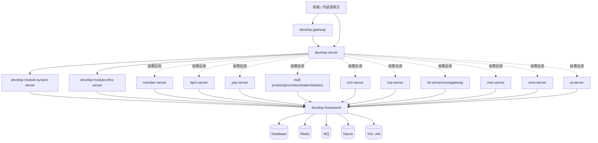

# Smart Cloud 后端架构设计文档

> 文档版本：2026-05-23  
> 代码基线：当前工作区源码结构  
> 适用范围：`develop-dependencies`、`develop-framework`、`develop-gateway`、`develop-server`、`develop-module-*` 后端工程  
> 类与方法定义索引：[`docs/backend-class-method-index.md`](backend-class-method-index.md)

## 1. 文档目的

本文档用于说明 Smart Cloud 后端系统的整体架构、模块划分、插件/Starter 使用、模块之间的依赖关系、业务模块内部实现方式、包名职责、类定义与方法定义索引。文档格式按常见企业级架构设计文档组织，既可用于研发交接，也可用于二次开发、模块裁剪、部署规划和 DDD 重构延续。

当前工程是一个基于 Spring Cloud Alibaba 与 Spring Boot 的微服务/模块化快速开发平台。代码既支持通过 `develop-server` 组装为单体后端，也保留了 Spring Cloud Gateway、Nacos、Feign、MQ、XXL-Job 等分布式能力。业务模块采用 `api + server` 拆分；部分模块已经引入 DDD 分层，部分模块仍保留传统三层结构，因此当前架构是“模块化单体 + 微服务支撑能力 + DDD 渐进式重构”的混合形态。

## 2. 总体架构

### 2.1 架构分层

系统按以下层次组织：

```text
前端应用 / 外部系统
        │
        ▼
develop-gateway（API 网关，可选）
        │
        ▼
develop-server（后端主容器，按依赖装配业务模块）
        │
        ├── develop-module-system-server
        ├── develop-module-infra-server
        ├── develop-module-member-server
        ├── develop-module-bpm-server
        ├── develop-module-pay-server
        ├── develop-module-mall 子模块
        ├── develop-module-crm-server
        ├── develop-module-erp-server
        ├── develop-module-iot-server / core / gateway
        ├── develop-module-mes-server
        ├── develop-module-wms-server
        └── develop-module-ai-server
        │
        ▼
develop-framework（通用能力 Starter）
        │
        ▼
数据库 / Redis / MQ / Nacos / XXL-Job / 第三方平台
```

### 2.2 核心设计原则

1. **模块化拆分**：每个业务域独立为 Maven 模块，通常包含 `api` 与 `server` 两个子模块。
2. **主容器装配**：`develop-server` 本身不承载业务逻辑，通过 Maven 依赖决定启用哪些业务模块。
3. **基础能力下沉**：Web、安全、MyBatis、Redis、MQ、RPC、租户、数据权限、监控等通用能力沉淀到 `develop-framework`。
4. **接口与实现隔离**：`api` 模块暴露跨模块 DTO、枚举、RPC API；`server` 模块实现业务逻辑、数据访问和控制器。
5. **DDD 渐进迁移**：新结构采用 `domain/application/infrastructure/controller`；旧结构仍保留 `controller/service/dal/convert`。
6. **统一依赖治理**：`develop-dependencies` 作为 BOM 管理 Spring、MyBatis、Redis、Flowable、MQ、工具库等版本。

## 3. Maven 工程结构

### 3.1 顶层模块

| 模块 | 职责 |
|---|---|
| `develop-dependencies` | BOM 依赖版本管理，统一第三方依赖与内部 Starter 版本。 |
| `develop-framework` | 基础框架与通用 Starter，向业务模块提供可复用能力。 |
| `develop-gateway` | Spring Cloud Gateway 网关，提供路由、聚合、文档、鉴权入口能力。 |
| `develop-server` | 后端主启动容器，通过依赖装配业务模块。 |
| `develop-module-system` | 系统管理基础模块。 |
| `develop-module-infra` | 基础设施管理模块。 |
| `develop-module-member` | 会员中心模块。 |
| `develop-module-bpm` | 工作流模块。 |
| `develop-module-pay` | 支付模块。 |
| `develop-module-report` | 报表模块。 |
| `develop-module-mp` | 微信公众号模块。 |
| `develop-module-mall` | 商城聚合模块，包含商品、营销、交易、统计子域。 |
| `develop-module-crm` | 客户关系管理模块。 |
| `develop-module-erp` | 企业资源计划模块。 |
| `develop-module-iot` | 物联网模块，包含 server/core/gateway。 |
| `develop-module-mes` | 制造执行系统模块。 |
| `develop-module-wms` | 仓储管理模块。 |
| `develop-module-ai` | AI 大模型能力模块。 |

### 3.2 `api + server` 拆分规则

大部分业务模块采用如下结构：

```text
develop-module-xxx/
├── develop-module-xxx-api      # 跨模块接口、DTO、枚举、RPC API
└── develop-module-xxx-server   # 业务实现、Controller、Service、Domain、DAL、MQ、Job
```

拆分目的：

- 其他模块只依赖 `api`，避免直接依赖实现。
- `server` 可独立编译和测试，负责完整业务闭环。
- `develop-server` 只引入需要运行的 `server` 模块。

### 3.3 `develop-server` 装配关系

`develop-server` 是后端主应用。当前默认启用：

- `develop-module-system-server`
- `develop-module-infra-server`

其他模块如会员、工作流、支付、商城、CRM、ERP、AI、IoT、MES、WMS 等在 `develop-server/pom.xml` 中以注释依赖形式存在，需要时取消注释即可参与启动。该设计用于在开发时降低编译和启动成本，同时保留完整业务能力。

### 3.4 `develop-gateway` 网关关系

`develop-gateway` 基于 Spring Cloud Gateway WebFlux 实现，主要依赖：

- `spring-cloud-starter-gateway-server-webflux`
- `knife4j-gateway-spring-boot-starter`
- `spring-cloud-starter-loadbalancer`
- `spring-cloud-starter-alibaba-nacos-discovery`
- `spring-cloud-starter-alibaba-nacos-config`
- `develop-module-system-api`
- `develop-spring-boot-starter-monitor`

网关不实现业务，只承担统一入口、路由、服务发现、配置接入、文档聚合和监控接入职责。

## 4. 技术栈与插件

### 4.1 基础技术栈

| 分类 | 技术 |
|---|---|
| JDK | Java 17 |
| 应用框架 | Spring Boot 3.5.x |
| 微服务 | Spring Cloud 2025.0.1、Spring Cloud Alibaba 2025.0.0.0 |
| 注册/配置中心 | Nacos Discovery、Nacos Config |
| 网关 | Spring Cloud Gateway |
| ORM | MyBatis、MyBatis Plus、MyBatis Plus Join |
| 多数据源 | dynamic-datasource |
| 数据库连接池 | Druid |
| 缓存/锁 | Redis、Redisson、Lock4j |
| 消息队列 | Redis MQ、RabbitMQ、RocketMQ 抽象支持 |
| 工作流 | Flowable 7.2.0 |
| 定时任务 | XXL-Job |
| 接口文档 | Springdoc OpenAPI、Knife4j |
| 对象转换 | MapStruct |
| 代码简化 | Lombok |
| 工具库 | Hutool、Guava、Apache Commons、FastJSON、Jsoup、Tika |
| 测试 | JUnit 5、Spring Boot Test、Mockito、Jedis Mock、Podam |
| 监控链路 | SkyWalking、OpenTracing、Spring Boot Admin |
| 报表 | JimuReport、JimuBI |
| 支付/微信 | Alipay SDK、weixin-java-pay、wx-java-mp |
| IoT 协议 | MQTT、Vert.x、CoAP、Modbus |

### 4.2 Maven 插件

| 插件 | 作用 |
|---|---|
| `maven-compiler-plugin` | Java 编译，启用 `-parameters`，配置 Lombok、MapStruct、Spring 配置元数据注解处理器。 |
| `maven-surefire-plugin` | 执行 JUnit 5 单元测试和模块测试。 |
| `flatten-maven-plugin` | 统一 revision 版本，生成可发布 POM。 |
| `spring-boot-maven-plugin` | 对 `develop-server`、`develop-gateway` 等应用模块执行 repackage 打包。 |

### 4.3 Framework Starter 清单

| Starter | 包名前缀 | 功能 |
|---|---|---|
| `develop-common` | `com.develop.mvp.pk.framework.common` | 通用 POJO、枚举、异常、工具类、跨模块通用 API 定义。 |
| `develop-spring-boot-starter-web` | `framework.web/apilog/swagger/jackson/xss/encrypt` | REST Web 基础、全局异常、API 日志、Swagger/Knife4j、Jackson、XSS、API 加密。 |
| `develop-spring-boot-starter-security` | `framework.security/operatelog` | Spring Security、登录用户上下文、权限校验、操作日志 RPC。 |
| `develop-spring-boot-starter-mybatis` | `framework.mybatis/datasource/translate` | MyBatis Plus、多数据源、数据翻译、分页与查询增强。 |
| `develop-spring-boot-starter-redis` | `framework.redis` | Redis、Redisson、缓存配置。 |
| `develop-spring-boot-starter-mq` | `framework.mq` | Redis/RabbitMQ/RocketMQ 等消息生产消费抽象。 |
| `develop-spring-boot-starter-rpc` | `framework.rpc` | OpenFeign、负载均衡、跨模块/跨服务调用支撑。 |
| `develop-spring-boot-starter-job` | `framework.quartz` | XXL-Job 与异步任务配置。 |
| `develop-spring-boot-starter-monitor` | `framework.tracer` | 链路追踪、指标、监控接入。 |
| `develop-spring-boot-starter-protection` | `framework.signature` | API 签名、幂等、锁、限流等服务保护能力。 |
| `develop-spring-boot-starter-websocket` | `framework.websocket` | WebSocket 会话、消息发送、多节点广播。 |
| `develop-spring-boot-starter-excel` | `framework.excel/dict` | Excel 导入导出、字典格式化。 |
| `develop-spring-boot-starter-test` | `framework.test` | 测试基类、断言、随机对象、测试工具。 |
| `develop-spring-boot-starter-biz-tenant` | `framework.tenant` | 多租户上下文、租户过滤、RPC 租户传播。 |
| `develop-spring-boot-starter-biz-data-permission` | `framework.datapermission` | 数据权限规则、部门数据权限、SQL 过滤。 |
| `develop-spring-boot-starter-biz-ip` | `framework.ip` | IP 归属地、区域解析。 |
| `develop-spring-boot-starter-env` | `framework.env` | 环境标识、环境透传、Web/RPC 环境配置。 |

## 5. 模块依赖关系

### 5.1 运行期依赖



### 5.2 编译期依赖规则

1. `server` 模块可以依赖本模块 `api`。
2. 模块之间互相调用时优先依赖对方 `api`，避免依赖对方 `server`。
3. `develop-server` 依赖各业务 `server`，作为启动容器。
4. `develop-gateway` 只依赖必要 `api` 和网关基础能力，不依赖业务实现。
5. 所有模块通过 `develop-framework` 获得基础能力。
6. 所有版本由 `develop-dependencies` 或根 POM 统一管理。

## 6. 通用包名与分层说明

### 6.1 基础包名

项目 Java 基础包名为：

```text
com.develop.mvp.pk
```

业务模块包名：

```text
com.develop.mvp.pk.module.{moduleName}
```

框架能力包名：

```text
com.develop.mvp.pk.framework.{capability}
```

### 6.2 业务模块常见包职责

| 包名 | 职责 |
|---|---|
| `api` | 跨模块 API、DTO、枚举、RPC 接口。 |
| `controller.admin` | 管理后台 REST API。 |
| `controller.app` | 用户端/移动端 REST API。 |
| `controller.*.vo` | 请求 VO、响应 VO、分页 VO。 |
| `service` | 传统三层业务接口。 |
| `service.impl` | 传统三层业务实现。 |
| `dal.dataobject` | 数据库表映射 DO。 |
| `dal.mysql` | MyBatis Plus Mapper。 |
| `dal.redis` | Redis Key、缓存访问对象。 |
| `convert` | MapStruct 转换器，负责 DO/DTO/VO/Domain 转换。 |
| `enums` | 模块内枚举、错误码、状态值。 |
| `framework` | 模块内配置、拦截器、扩展点。 |
| `mq` | 消息生产者、消费者、消息体。 |
| `job` | XXL-Job 定时任务处理器。 |
| `domain` | DDD 领域层，聚合根、值对象、领域事件、领域服务、仓储接口。 |
| `application` | DDD 应用层，用例编排、事务边界、调用领域对象和仓储接口。 |
| `infrastructure` | DDD 基础设施层，仓储实现、外部适配器、持久化实现、事件发布实现。 |

### 6.3 DDD 分层调用方向

```text
controller -> application -> domain
                         -> domain.repository 接口
infrastructure -> domain.repository 接口实现
infrastructure -> dal.mapper / external sdk / mq / redis
```

约束：

- `domain` 不依赖 Spring、MyBatis、Controller、DO、VO。
- `application` 负责编排，不承载复杂业务规则。
- `infrastructure` 负责技术细节和外部系统适配。
- `controller` 负责协议转换、参数校验、权限注解和响应封装。

### 6.4 传统三层调用方向

```text
controller -> service -> dal.mapper -> database
controller -> convert -> VO/DTO/DO 转换
service -> api/commonApi/rpc/mq/job/framework
```

传统三层仍在大量模块中存在，后续 DDD 重构时应按聚合逐步迁移，不应一次性大范围重写。

## 7. 业务模块设计

### 7.1 System 系统管理模块

**模块路径**：`develop-module-system`  
**包名**：`com.develop.mvp.pk.module.system`  
**职责**：提供平台基础治理能力，包括用户、部门、岗位、角色、菜单、权限、租户、字典、OAuth2、登录日志、操作日志、站内信、通知等。

**实现方式**：

- `api` 暴露系统能力给其他模块，例如用户、权限、租户、字典、OAuth2 Token、操作日志等通用 API。
- `controller.admin` 提供后台管理接口。
- `service` 实现用户组织权限、认证授权、租户、日志等传统业务逻辑。
- `domain/application/infrastructure` 承载已迁移的 DDD 聚合。
- `mq` 用于异步日志、通知等事件处理。
- `job` 用于系统侧定时维护任务。
- `framework` 提供系统模块的自动配置和扩展。

**模块关系**：

- 被 `develop-server` 默认依赖。
- 被 `develop-gateway` 依赖其 `api`，用于网关鉴权/用户信息/接口文档等。
- 被几乎所有业务模块间接依赖，用于用户、租户、字典、权限和日志。

### 7.2 Infra 基础设施模块

**模块路径**：`develop-module-infra`  
**包名**：`com.develop.mvp.pk.module.infra`  
**职责**：提供文件、代码生成、数据源配置、API 日志、错误日志、配置管理、定时任务管理、WebSocket、数据库工具等基础设施管理能力。

**实现方式**：

- `api` 暴露日志、文件、配置等基础设施接口。
- `controller.admin` 提供代码生成、文件、数据源、日志等后台管理接口。
- `service` 处理传统基础设施业务。
- `application/domain/infrastructure` 承载 DDD 改造后的基础设施聚合。
- `job` 管理基础设施定时任务。
- `mq` 处理日志与异步基础设施消息。
- `websocket` 提供 WebSocket 连接和消息能力。

**模块关系**：

- 被 `develop-server` 默认依赖。
- 为其他模块提供文件存储、日志记录、配置读取、代码生成等平台能力。

### 7.3 Member 会员模块

**模块路径**：`develop-module-member`  
**包名**：`com.develop.mvp.pk.module.member`  
**职责**：管理会员用户、会员等级、积分、签到、收货地址、会员标签、会员分组等用户侧能力。

**实现方式**：

- `api` 提供会员用户、地址、等级等跨模块调用接口。
- `controller.admin` 面向后台运营管理。
- `controller.app` 面向用户端。
- `domain` 定义会员相关聚合和值对象。
- `application` 编排会员用例。
- `infrastructure` 负责会员聚合持久化与外部适配。
- `mq` 处理会员注册、积分变更、等级变化等异步消息。

**模块关系**：

- 商城交易、营销、支付等模块可通过 `member-api` 获取会员信息。
- 依赖 System 的用户、租户、字典能力。

### 7.4 BPM 工作流模块

**模块路径**：`develop-module-bpm`  
**包名**：`com.develop.mvp.pk.module.bpm`  
**职责**：提供流程定义、流程模型、流程实例、任务审批、表单、OA 请假等工作流能力。

**实现方式**：

- 使用 Flowable 作为流程引擎。
- `controller.admin` 管理流程模型、定义、任务、实例和表单。
- `service` 封装 Flowable RuntimeService、RepositoryService、TaskService 等操作。
- `domain/application/infrastructure` 承载部分 DDD 聚合与应用编排。
- `framework` 放置 Flowable 配置、监听器、扩展处理器。
- `convert` 负责 Flowable 对象、DO、VO 之间转换。

**模块关系**：

- 依赖 System 用户、部门、角色能力用于审批人解析。
- 可被 ERP、CRM、MES 等业务模块接入审批流程。

### 7.5 Pay 支付模块

**模块路径**：`develop-module-pay`  
**包名**：`com.develop.mvp.pk.module.pay`  
**职责**：提供支付应用、支付渠道、支付订单、退款订单、转账、回调通知、支付钱包等支付基础能力。

**实现方式**：

- `api` 暴露支付订单、退款、钱包等跨模块接口。
- `controller.admin` 管理支付应用、渠道、订单和退款。
- `controller.app` 处理用户侧支付、退款、钱包操作。
- `service` 对接微信支付、支付宝等 SDK。
- `domain/application/infrastructure` 承载支付领域模型与仓储实现。
- `job` 处理支付订单同步、退款同步、超时关闭等定时任务。
- `mq` 发布支付成功、退款成功等业务消息。

**模块关系**：

- 商城交易模块调用支付模块创建支付单。
- Member 模块可调用钱包相关能力。
- Infra/System 提供日志、租户、配置等基础能力。

### 7.6 Mall 商城模块

商城由多个子域组成，每个子域有独立 `api/server`：

| 子域 | 模块 | 职责 |
|---|---|---|
| 商品 | `develop-module-product-*` | 商品 SPU/SKU、分类、品牌、属性、库存、评价。 |
| 营销 | `develop-module-promotion-*` | 优惠券、秒杀、拼团、砍价、满减、积分商城、活动。 |
| 交易 | `develop-module-trade-*` | 购物车、订单、售后、配送、结算、分销。 |
| 统计 | `develop-module-statistics-*` | 商城运营统计、交易统计、商品统计、会员统计。 |

**实现方式**：

- `product` 提供商品基础数据，被营销和交易引用。
- `promotion` 管理活动规则，通过 API 向交易模块提供价格、优惠和活动校验。
- `trade` 负责交易主流程，调用会员、商品、营销、支付、物流等能力。
- `statistics` 从交易、商品、会员等数据中聚合统计指标。
- 各子域均保留传统三层结构，同时部分子域已有 DDD `domain/application/infrastructure` 包。

**模块关系**：

```text
trade -> product-api
trade -> promotion-api
trade -> member-api
trade -> pay-api
statistics -> trade/product/member 数据与 API
promotion -> product/member 数据与 API
```

### 7.7 CRM 客户关系模块

**模块路径**：`develop-module-crm`  
**包名**：`com.develop.mvp.pk.module.crm`  
**职责**：管理客户、联系人、商机、合同、回款、线索、跟进记录、客户公海、数据统计等 CRM 能力。

**实现方式**：

- `controller.admin` 提供 CRM 后台操作接口。
- `service` 管理客户、合同、商机、线索等核心业务。
- `domain/application/infrastructure` 承载已迁移聚合。
- `job` 用于跟进提醒、统计刷新等定时任务。
- `dal` 使用 MyBatis Plus 管理 CRM 数据表。

**模块关系**：

- 可依赖 System 的用户、部门、权限和数据权限。
- 可与 BPM 集成做合同审批、回款审批等流程。
- 可与 ERP/财务场景共享客户、合同和回款数据。

### 7.8 ERP 企业资源计划模块

**模块路径**：`develop-module-erp`  
**包名**：`com.develop.mvp.pk.module.erp`  
**职责**：提供采购、销售、库存、财务、产品、供应商、客户等企业经营管理能力。

**实现方式**：

- `controller.admin` 提供 ERP 管理接口。
- `service` 实现采购、销售、库存和财务业务流程。
- `dal` 持久化 ERP 单据、明细和基础资料。
- `domain/application/infrastructure` 承载部分 DDD 聚合。
- 使用 System 用户、部门、数据权限实现组织级访问控制。

**模块关系**：

- 可与 CRM 共享客户资料。
- 可与 WMS/MES 在库存、生产和出入库场景联动。
- 可接入 BPM 做采购、销售、财务审批。

### 7.9 IoT 物联网模块

**模块路径**：`develop-module-iot`  
**包名**：`com.develop.mvp.pk.module.iot`  
**职责**：提供产品、设备、物模型、设备消息、协议网关、规则处理、设备接入等物联网能力。

**子模块**：

| 子模块 | 职责 |
|---|---|
| `develop-module-iot-api` | IoT 跨模块接口和 DTO。 |
| `develop-module-iot-server` | IoT 后台业务、设备管理、产品管理、数据管理。 |
| `develop-module-iot-core` | 物联网核心协议、设备会话、消息模型、通道抽象。 |
| `develop-module-iot-gateway` | IoT 协议网关，处理 MQTT/CoAP/Modbus 等接入。 |

**实现方式**：

- `core` 抽象设备、协议和消息通道。
- `gateway` 接入 MQTT、CoAP、Modbus、Vert.x 等协议栈。
- `server` 提供后台管理和持久化。
- `mq` 处理设备上报、命令下发、状态变更等异步事件。

**模块关系**：

- 依赖 Framework 的 MQ、Redis、WebSocket、MyBatis 能力。
- 可向 MES/WMS/ERP 输出设备数据或生产现场数据。

### 7.10 MES 制造执行模块

**模块路径**：`develop-module-mes`  
**包名**：`com.develop.mvp.pk.module.mes`  
**职责**：提供生产计划、工单、工艺、工序、车间、设备、质量、物料、报工等制造执行能力。

**实现方式**：

- 当前以传统三层为主，`controller/service/dal/enums` 文件数量较多。
- `controller.admin` 提供制造执行后台接口。
- `service` 编排生产计划、工单流转、质量检验、物料消耗等业务流程。
- `dal` 管理 MES 大量业务表。
- `domain/application/infrastructure` 已建立基础 DDD 包，可作为后续按聚合迁移入口。

**模块关系**：

- 可与 ERP 共享订单、物料和库存。
- 可与 WMS 联动出入库与生产领退料。
- 可接入 IoT 设备数据用于生产状态采集。

### 7.11 WMS 仓储管理模块

**模块路径**：`develop-module-wms`  
**包名**：`com.develop.mvp.pk.module.wms`  
**职责**：提供仓库、库区、库位、库存、入库、出库、移库、盘点等仓储能力。

**实现方式**：

- `controller.admin` 提供 WMS 后台接口。
- `service` 保留传统仓储业务流程。
- `domain.inventory` 已引入库存聚合，管理库存数量、库存事件和业务不变量。
- `application.inventory` 负责编排创建库存、变更库存、发布领域事件。
- `infrastructure.inventory` 负责库存聚合持久化。
- `infrastructure.event` 适配 Spring 事件发布。

**模块关系**：

- 可与 ERP、MES 共享库存与出入库数据。
- 可与 IoT 设备数据联动仓储自动化设备。

### 7.12 AI 大模型模块

**模块路径**：`develop-module-ai`  
**包名**：`com.develop.mvp.pk.module.ai`  
**职责**：提供 AI 模型、API Key、聊天、图片、音乐、知识库、向量分段、思维导图、工作流、工具调用等 AI 能力。

**实现方式**：

- `controller.admin` 提供 AI 后台管理接口。
- `service` 实现聊天、知识库、图片、音乐、工具、工作流等 AI 用例。
- `domain.model` 等 DDD 包承载模型聚合和模型唯一性等约束。
- `application.model` 编排 AI 模型创建、更新、校验等流程。
- `infrastructure.model` 适配 MyBatis 持久化。
- `job` 可用于知识库处理、异步任务等。

**模块关系**：

- 依赖 Infra 的文件、配置能力。
- 依赖 System 的权限、用户、租户能力。
- 可作为其他业务模块的智能化扩展能力。

### 7.13 MP 微信公众号模块

**模块路径**：`develop-module-mp`  
**包名**：`com.develop.mvp.pk.module.mp`  
**职责**：提供公众号账号、菜单、粉丝、标签、素材、自动回复、消息管理等微信公众平台能力。

**实现方式**：

- 使用 `wx-java-mp-spring-boot-starter` 对接微信公众号。
- `controller.admin` 管理公众号配置和运营数据。
- `service` 负责微信接口调用、消息处理、素材同步等。
- `framework` 放置微信 SDK 配置和消息处理扩展。
- `dal` 存储公众号账号、粉丝、素材、消息等数据。

**模块关系**：

- 依赖 System 用户和租户能力。
- 可与 Member 关联微信粉丝与会员。

### 7.14 Report 报表模块

**模块路径**：`develop-module-report`  
**包名**：`com.develop.mvp.pk.module.report`  
**职责**：提供报表设计、数据可视化、积木报表、BI 能力。

**实现方式**：

- 集成 JimuReport 与 JimuBI。
- `controller` 暴露报表管理和访问接口。
- `service` 处理报表配置、数据源和权限逻辑。
- `framework` 放置报表相关配置。
- `domain/application/infrastructure` 已建立基础 DDD 包。

**模块关系**：

- 依赖 Infra 的数据源能力。
- 依赖 System 的权限与租户能力。
- 可读取各业务模块数据用于可视化分析。

## 8. 类定义与方法定义说明

### 8.1 类类型约定

| 类型后缀 | 定义 |
|---|---|
| `*Controller` | REST 控制器，负责 HTTP 协议、权限注解、参数校验、响应封装。 |
| `*Service` | 业务服务接口，定义传统三层业务能力。 |
| `*ServiceImpl` | 业务服务实现，负责编排 DAL、RPC、MQ、事务。 |
| `*ApplicationService` | DDD 应用服务，负责编排用例、事务边界、领域对象和仓储接口。 |
| `*Repository` | DDD 仓储接口，定义领域聚合持久化能力。 |
| `*RepositoryImpl` | DDD 仓储实现，适配 MyBatis、Redis 或外部系统。 |
| `*Mapper` | MyBatis Plus Mapper，负责数据库 CRUD。 |
| `*DO` | Data Object，数据库表映射对象。 |
| `*VO` | View Object，Controller 请求/响应对象。 |
| `*DTO` | Data Transfer Object，跨模块或跨服务传输对象。 |
| `*Convert` | MapStruct 转换器，处理 VO/DTO/DO/Domain 转换。 |
| `*Event` | 领域事件或 MQ 消息事件。 |
| `*Message` | MQ 消息体。 |
| `*Job` / `*JobHandler` | 定时任务处理器。 |
| `*AutoConfiguration` | Spring Boot 自动配置类。 |
| `*Properties` | 配置属性类。 |
| `*Utils` | 通用静态工具类。 |

### 8.2 方法定义约定

常见方法命名约定：

| 方法前缀 | 语义 |
|---|---|
| `create*` | 创建业务对象或聚合。 |
| `update*` | 更新业务对象。 |
| `delete*` | 删除业务对象，通常会做存在性校验。 |
| `get*` | 查询单个对象。 |
| `get*Page` | 分页查询。 |
| `get*List` | 列表查询。 |
| `validate*` | 校验业务规则。 |
| `build*` | 构建对象、查询条件或上下文。 |
| `convert*` | 数据结构转换。 |
| `send*` | 发送消息、通知或请求。 |
| `publish*` | 发布领域事件或 MQ 消息。 |
| `sync*` | 与外部系统同步数据。 |
| `parse*` | 解析参数、表达式或外部数据。 |

### 8.3 完整类与方法索引

当前代码量较大，静态扫描范围内包含：

- Java 文件：5569 个。
- Controller：407 个。
- 服务类/应用服务类：820 个。
- Mapper：391 个。
- Repository/RepositoryImpl：135 个。

为避免主文档不可维护，完整类定义与方法定义单独生成在：

```text
docs/backend-class-method-index.md
```

该索引按模块列出：

- Java 文件路径。
- 包名。
- 类/接口/枚举/注解类型名称。
- 可提取的方法签名。

使用方式：

1. 先阅读本文档理解系统边界和模块职责。
2. 再打开 `backend-class-method-index.md` 定位具体类与方法。
3. 最后以源码为准查看方法体实现和业务细节。

## 9. 典型请求链路

### 9.1 后台管理接口链路

```text
HTTP Request
  -> Admin Controller
  -> 参数校验 / 权限注解 / 租户上下文
  -> Service 或 ApplicationService
  -> Domain / Repository 或 DAL Mapper
  -> Database / Redis / MQ / 外部系统
  -> Convert 转换响应对象
  -> CommonResult 返回
```

### 9.2 DDD 聚合写入链路

```text
Controller
  -> ApplicationService 开启事务
  -> Factory 创建聚合
  -> Domain 校验不变量
  -> Repository.save
  -> RepositoryImpl 转换 Domain <-> DO
  -> Mapper.insert/update
  -> 发布 DomainEvent
  -> 返回聚合 ID 或结果
```

### 9.3 跨模块调用链路

```text
调用方 server 模块
  -> 依赖目标模块 api
  -> CommonApi / RPC API / DTO
  -> 目标模块 server 实现
  -> 返回 DTO
```

单体模式下，调用可通过 Spring Bean 直接注入；微服务模式下，可通过 RPC/Feign 能力扩展为远程调用。

## 10. 数据与基础设施设计

### 10.1 数据库访问

- 使用 MyBatis Plus 作为主 ORM。
- `DO` 对应数据库表。
- `Mapper` 继承 MyBatis Plus 基础 Mapper 或项目封装 Mapper。
- 分页、条件查询、联表查询通过 MyBatis Plus、MyBatis Plus Join 和项目工具封装完成。
- 支持 dynamic-datasource 多数据源。
- SQL 初始化脚本位于 `sql/`，支持 MySQL、Oracle、PostgreSQL、SQL Server、DM、Kingbase、OpenGauss 等。

### 10.2 缓存设计

- Redis 用于登录态、验证码、缓存、分布式锁、消息队列等场景。
- Redisson 提供分布式锁和高级 Redis 能力。
- `framework.redis` 统一缓存配置。
- 业务模块的 Redis Key 通常放在 `dal.redis` 或 framework 配置中。

### 10.3 消息设计

- `develop-spring-boot-starter-mq` 抽象消息能力。
- 业务模块通过 `mq.producer`、`mq.consumer`、`mq.message` 组织消息代码。
- 可支持 Redis Stream、RabbitMQ、RocketMQ 等不同实现。
- 支付成功、库存变更、会员变化、日志记录等适合异步消息。

### 10.4 定时任务设计

- 使用 XXL-Job。
- Starter：`develop-spring-boot-starter-job`。
- 业务 Job 通常位于模块 `job` 包。
- 支付同步、订单超时、统计刷新、日志清理等场景通过 Job 执行。

### 10.5 权限与租户

- Security Starter 负责认证、授权和登录用户上下文。
- Tenant Starter 负责租户上下文、租户隔离和 RPC 透传。
- Data Permission Starter 负责部门/角色/自定义数据范围过滤。
- System 模块提供用户、角色、菜单、部门、租户等基础数据。

## 11. 部署与运行形态

### 11.1 模块化单体模式

默认使用 `develop-server` 作为主应用，按需引入各业务 `server` 模块。优点是开发、调试和部署简单，适合中小团队和快速交付。

### 11.2 微服务演进模式

保留 Gateway、Nacos、RPC、MQ 等能力后，可逐步将业务模块拆成独立服务。演进顺序建议：

1. 先按业务边界稳定 API 模块。
2. 再拆分高负载或独立团队维护的模块。
3. 使用 Gateway 统一路由。
4. 使用 Nacos 做注册配置。
5. 使用 MQ 解耦跨模块异步流程。

## 12. 测试与验证

常用命令：

```bash
# 全量打包，跳过测试
mvn clean package -Dmaven.test.skip=true

# 编译指定模块及其依赖
mvn compile -pl develop-module-system/develop-module-system-server -am

# 运行指定模块测试
mvn test -pl develop-module-system/develop-module-system-server

# 运行指定测试类
mvn test -pl develop-module-system/develop-module-system-server -Dtest=AdminUserServiceImplTest

# 打包主服务
mvn clean package -pl develop-server -am -Dmaven.test.skip=true

# 启动主服务
mvn spring-boot:run -pl develop-server -am

# 启动网关
mvn spring-boot:run -pl develop-gateway -am
```

测试策略：

- Framework Starter 优先做单元测试和切片测试。
- 业务模块优先测试 ApplicationService、Domain、Repository 和关键 Service。
- DDD 聚合改动必须先有领域行为测试或应用服务测试。
- 跨模块能力通过 API DTO 和 CommonApi 做契约测试。

## 13. 后续维护建议

1. **持续补充 DDD Skill**：每个新聚合先定义 Skill，再重构代码。
2. **避免跨模块直接依赖 server**：跨模块只依赖 `api`。
3. **逐步收敛 Service 复杂度**：复杂业务规则迁移到 Domain，Service/ApplicationService 只做编排。
4. **保持文档与代码同步**：新增模块、Starter、聚合后同步更新本文档和类方法索引。
5. **按模块验证和提交**：避免一次提交混入多个无关业务域。
6. **主文档不堆砌全部源码**：类和方法级细节使用索引文件承载，正文保持架构可读性。
