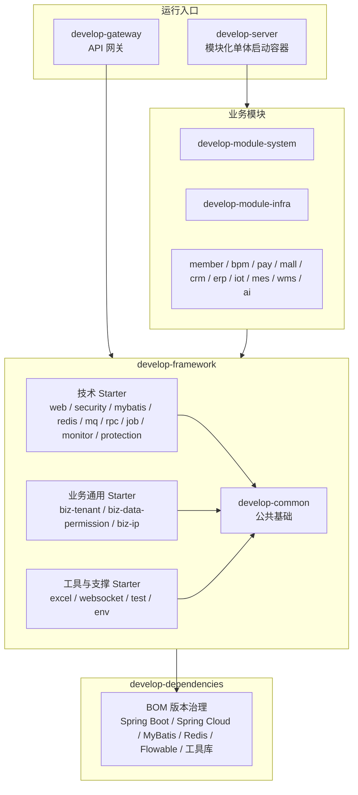
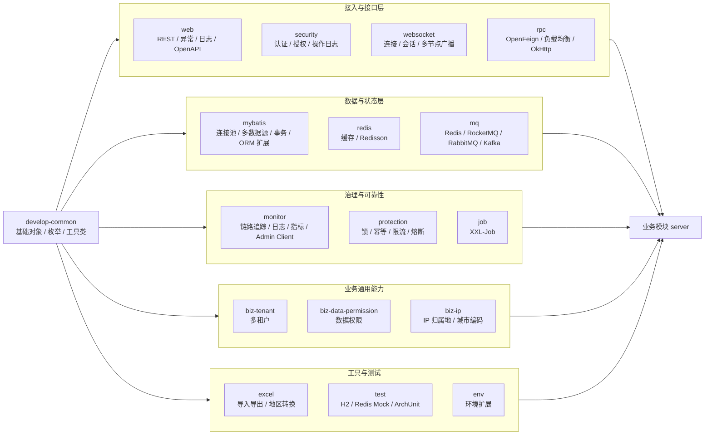
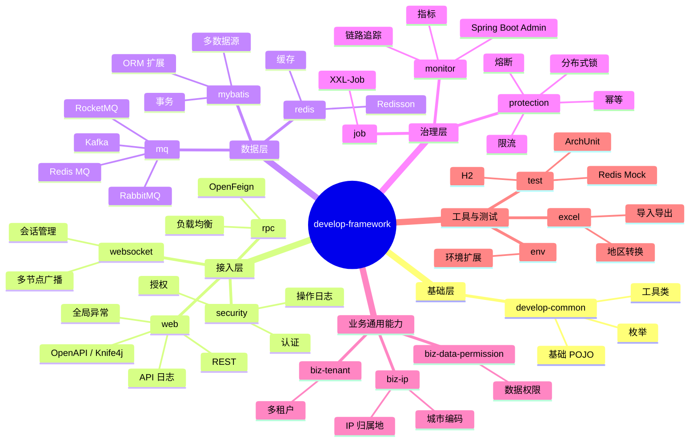
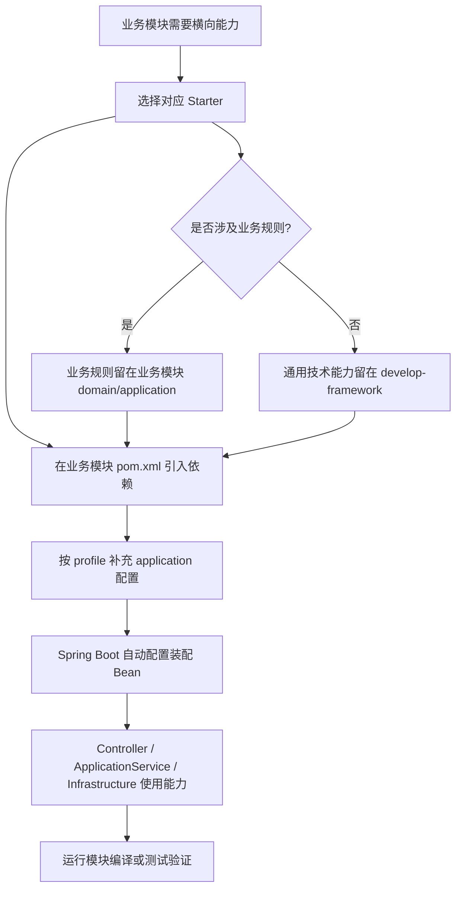
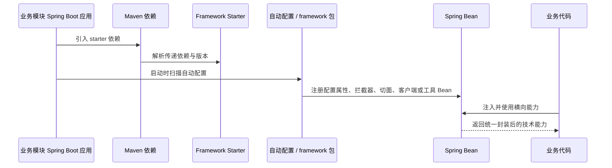
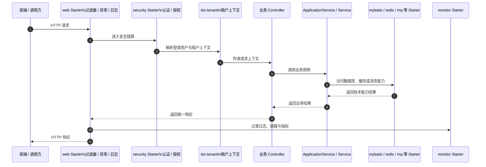

# Develop Framework README Overview Implementation Plan

> **For agentic workers:** REQUIRED SUB-SKILL: Use superpowers:subagent-driven-development (recommended) or superpowers:executing-plans to implement this plan task-by-task. Steps use checkbox (`- [ ]`) syntax for tracking.

**Goal:** Rewrite `develop-framework/README.md` into a professional top-level framework overview with clear architecture, responsibility boundaries, Mermaid diagrams, and build/maintenance guidance.

**Architecture:** This is documentation-only work. The README should summarize the `develop-framework` Maven aggregator and its child Spring Boot starters from existing POM/README facts, while avoiding implementation claims not verified from the repository. Diagrams should be embedded as Mermaid blocks so the documentation stays maintainable in Markdown.

**Tech Stack:** Markdown, Mermaid, Maven multi-module Java 17 / Spring Boot starter repository.

---

## File Structure

- Modify: `develop-framework/README.md`
  - Owns the top-level overview for the framework aggregator.
  - Must not duplicate every child starter README in detail.
  - Must include architecture diagram, flowchart, mind map, and sequence diagrams using Mermaid.
- Read-only facts to consult during execution:
  - `develop-framework/pom.xml`
  - `develop-framework/*/README.md`
  - `develop-framework/*/pom.xml`
  - root `README.md`
  - root `CLAUDE.md`

## Verified Source Facts

- `develop-framework` is a Maven `pom` aggregator.
- Child modules currently declared in `develop-framework/pom.xml`:
  - `develop-common`
  - `develop-spring-boot-starter-env`
  - `develop-spring-boot-starter-mybatis`
  - `develop-spring-boot-starter-redis`
  - `develop-spring-boot-starter-web`
  - `develop-spring-boot-starter-security`
  - `develop-spring-boot-starter-websocket`
  - `develop-spring-boot-starter-monitor`
  - `develop-spring-boot-starter-protection`
  - `develop-spring-boot-starter-job`
  - `develop-spring-boot-starter-mq`
  - `develop-spring-boot-starter-rpc`
  - `develop-spring-boot-starter-excel`
  - `develop-spring-boot-starter-test`
  - `develop-spring-boot-starter-biz-tenant`
  - `develop-spring-boot-starter-biz-data-permission`
  - `develop-spring-boot-starter-biz-ip`
- Existing top-level description states each technical component conceptually has:
  - `core` package for core encapsulation
  - `config` package for Spring configuration
- Child README/POM summary:
  - `develop-common`: base POJOs, enums, utility classes.
  - `develop-spring-boot-starter-env`: development/feature environment extension with Nacos discovery/config-related support.
  - `develop-spring-boot-starter-mybatis`: database connection pool, dynamic datasource, transaction, MyBatis extensions.
  - `develop-spring-boot-starter-redis`: Redis extension based on Spring cache and Redisson.
  - `develop-spring-boot-starter-web`: REST/web support, global exception handling, API logging, masking, error codes, OpenAPI/Knife4j.
  - `develop-spring-boot-starter-security`: authentication, authorization, and operation log support.
  - `develop-spring-boot-starter-websocket`: WebSocket framework with multi-node broadcast support.
  - `develop-spring-boot-starter-monitor`: tracing, log service, metrics, Spring Boot Admin client.
  - `develop-spring-boot-starter-protection`: distributed lock, idempotency, rate limiting, circuit breaking.
  - `develop-spring-boot-starter-job`: XXL-Job extension.
  - `develop-spring-boot-starter-mq`: MQ abstraction for Redis, RocketMQ, RabbitMQ, Kafka.
  - `develop-spring-boot-starter-rpc`: OpenFeign REST API calls, load balancing, Feign/OkHttp.
  - `develop-spring-boot-starter-excel`: Excel import/export and area conversion support.
  - `develop-spring-boot-starter-test`: test support with H2, Redis mock, POJO generation, ArchUnit.
  - `develop-spring-boot-starter-biz-tenant`: multi-tenancy support.
  - `develop-spring-boot-starter-biz-data-permission`: data permission support.
  - `develop-spring-boot-starter-biz-ip`: IP-to-city and city-code lookup based on ip2region and administrative division data.

---

### Task 1: Replace Top-Level README With Professional Overview

**Files:**
- Modify: `develop-framework/README.md`

- [ ] **Step 1: Re-read existing README and POM before editing**

Run/read:
```text
Read develop-framework/README.md
Read develop-framework/pom.xml
```
Expected: existing README has the current simple module positioning, submodule table, build commands, and maintenance suggestions.

- [ ] **Step 2: Replace README content with this structure**

Use the following section order exactly:

```markdown
# develop-framework

## 模块定位
## 阅读导航
## 设计目标
## 总体架构图
## Starter 能力分层图
## 框架能力思维导图
## 子模块职责矩阵
## 业务模块接入流程
## Spring Boot 自动配置时序
## 典型 Web 请求链路
## 依赖与边界规则
## 构建与验证
## 维护建议
```

- [ ] **Step 3: Write module positioning section**

Include these points in polished Chinese prose:

```markdown
`develop-framework` 是 Smart Cloud 的通用框架与 Spring Boot Starter 聚合层，负责把 Web、安全、数据访问、缓存、消息、RPC、任务、监控、租户、数据权限、Excel、测试等横向能力沉淀为可复用组件。

它不承载具体业务用例，也不反向依赖业务模块；业务模块通过 Maven 依赖按需引入 Starter，并在 Spring Boot 自动配置、拦截器、切面、工具类和基础服务的帮助下获得统一技术能力。
```

- [ ] **Step 4: Add Mermaid overall architecture diagram**

Add this diagram under `## 总体架构图`:

````markdown

````

- [ ] **Step 5: Add Starter capability layering diagram**

Add this diagram under `## Starter 能力分层图`:

````markdown

````

- [ ] **Step 6: Add Mermaid mind map**

Add this diagram under `## 框架能力思维导图`:

````markdown

````

- [ ] **Step 7: Add child module responsibility matrix**

Create a Markdown table with these columns:

```markdown
| 子模块 | 类型 | 核心职责 | 典型使用方 |
|---|---|---|---|
```

Include all 17 child modules from the verified source facts. Keep each responsibility one concise sentence. Do not claim configuration keys or APIs unless visible in child docs.

- [ ] **Step 8: Add business module onboarding flowchart**

Add this diagram under `## 业务模块接入流程`:

````markdown

````

- [ ] **Step 9: Add Spring Boot auto-configuration sequence diagram**

Add this diagram under `## Spring Boot 自动配置时序`:

````markdown

````

- [ ] **Step 10: Add typical Web request sequence diagram**

Add this diagram under `## 典型 Web 请求链路`:

````markdown

````

- [ ] **Step 11: Add dependency and boundary rules**

Include these rules:

```markdown
- `develop-framework` 输出横向技术能力，不承载具体业务用例。
- Starter 可以依赖 `develop-common` 和必要的第三方库，版本由 `develop-dependencies` 统一治理。
- 业务模块可以依赖 Starter；Starter 不应反向依赖具体业务模块。
- 多租户、数据权限、IP 归属地等业务通用能力放在 `biz-*` Starter，避免散落到各业务模块重复实现。
- 业务规则、领域不变量和用例编排仍属于业务模块的 `domain` / `application` / `infrastructure`，不应下沉到 framework。
- 修改 Starter 时必须关注自动配置条件、默认 Bean、拦截器/切面顺序和对调用方的兼容影响。
```

- [ ] **Step 12: Add build and verification commands**

Use these commands:

```bash
# 编译 framework 聚合模块及其依赖
mvn compile -pl develop-framework -am

# 打包 framework 聚合模块及其依赖，跳过测试
mvn clean package -pl develop-framework -am -Dmaven.test.skip=true

# 修改某个 Starter 后，优先编译该 Starter 及依赖
mvn compile -pl develop-framework/develop-spring-boot-starter-web -am
```

- [ ] **Step 13: Save README**

Use `Write` for a complete rewrite or `Edit` if preserving parts is simpler. The final README must be in Chinese and should not reference this plan file.

- [ ] **Step 14: Verify Markdown content**

Run:
```bash
git diff --check -- develop-framework/README.md
```
Expected: no output and exit code 0.

- [ ] **Step 15: Review final diff**

Run:
```bash
git diff -- develop-framework/README.md
```
Expected: one documentation-only diff that rewrites the README and contains no application code changes.

- [ ] **Step 16: Optional compile check if user requests it**

This is a documentation-only change, so Maven compile is not required by default. If the user asks for build verification anyway, run:

```bash
mvn compile -pl develop-framework -am
```
Expected: Maven exits 0.

---

## Self-Review Checklist

- Spec coverage: The plan covers professional README structure, architecture diagram, flowchart, mind map, sequence diagrams, module matrix, boundaries, and verification.
- Placeholder scan: No TBD/TODO placeholders are present.
- Scope check: Only `develop-framework/README.md` is modified; no application code is touched.
- Fact discipline: Module responsibilities come from existing README/POM summaries and must be rechecked before writing.
